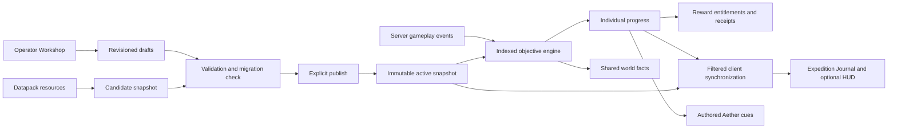

# Wilderness Odyssey quest system: technical specification

Status: Phase 1 foundation and Phase 2 native Workshop are implemented. Source, automated validation, packaging and remaining authentic-player/native-client acceptance are tracked in [Phase 1 evidence](phase-1-validation.md) and [Phase 2 evidence](phase-2-validation.md). Phases 3–6 remain planned.

Initial inspection: 2026-09-29; proposal review updated 2026-09-30. Inspected API checkout: `76ead35b`. Target: Minecraft Java 1.21.1, NeoForge, JDK 21. The inspected API uses NeoForge `21.1.248` and mod version `4.2.0`; the quest work does not change either version. The repository-owner table below records that initial inspection. Phase 1 integration has since advanced the shared payload protocol from 31 to 32.

## 1. Outcome and boundaries

Build an optional expedition quest system and a complete Workshop inside Minecraft. Players receive guidance, story, discoveries, and rewards while remaining free to ignore the campaign. Operators author, test, validate, publish, roll back, and export quests without a desktop application. Ordinary crafting, building, exploration, and dimension travel remain independent of quest completion. Existing story machinery may consult an explicit story requirement through its own authoritative gameplay owner.

The five campaign groups are Getting Started, Main Story, Dimension Adventures, Modpack Guides, and Exploration and Side Quests. A.E.T.H.E.R. dialogue is authored content; completion and rewards never require a model service, Ollama, voice synthesis, or internet access. Party progression is a future extension. FTB Quests remains installed throughout development and until the replacement gate in phase 6 is satisfied.

This document covers architecture and the complete roadmap. The accompanying phase 1 plan defines the first implementation increment. Later phases receive focused implementation plans after their dependencies exist; the whole subsystem is not a single change.

## 2. What the repository already provides

All API paths below are relative to the repository root.

| Existing owner | Verified behavior | Reuse and limit |
|---|---|---|
| `lorebook/LoreBookManager.java`, `LoreBookEvents.java` | Server-owned discovered lore and personal writing in player persistent NBT; explicit clone copying; throttled lore inventory discovery | Preserve the current data root and writing. Add a narrow discovery notification after a new lore ID is committed; do not create another lore authority. |
| `lorebook/client/codex/CodexScreen.java`, `CodexLayout.java`, `CodexClientEvents.java`, `lorebook/item/FieldCodexItem.java` | Guide, Journal, and Lore views; book styling; bounded writing; server-triggered opening and client disconnect cleanup | Add an Expeditions entry leading to a dedicated quest view. Preserve notes and lore. Existing fixed three-tab geometry needs deliberate adjustment. |
| `network/ModPayloads.java` | Central NeoForge payload registrar, bounded payload codecs, side-specific handlers; channel version `31` | Delegate new quest registrations to a feature-owned registrar and bump the shared version when integrating the new wire contract. Do not copy client references into quest common/server classes. |
| `command/ModCommands.java`, `cinematic/command/CinematicCommand.java` | Central command registration; `/wo sequence` already exists, with permission on the child node | Register `/wo quest` as a sibling. Keep the shared `/wo` root usable for existing commands and put permissions on individual operations. |
| `server/ServerLifecycleEvents.java`, `faq/FaqReloadListener.java`, `ecosystem/data/SpeciesBehaviorProfileReloadListener.java` | `AddReloadListenerEvent`, JSON resource loading, server service startup/shutdown, immutable-generation refresh pattern | Reuse registration and reload lifecycle. Quest resource preparation builds a candidate; activation is an explicit publication decision. |
| `config/WildernessConfigSpecs.java`, `ModConfigRegistration.java` | Three composed common/client/server configuration files with feature-owned categories | Add server quest permissions and budgets and later client presentation choices to these files. Do not add competing standalone config specifications. |
| `ai/voice/VoiceLine.java`, `lorebook/client/codex/LoreNarration.java`, cinematic narration payloads | Deterministic `VoiceLine.authored(...)` presentation without inference | Use authored mission cues with text always available. Optional audio presentation must not gate quests. AI onboarding state is not quest progress. |
| `worldgen/spawn/CryoSpawnData.java`, `SpawnBunkerPlacer.java` | Versioned SavedData and successful starter-bunker bounds | A starter-bunker adapter can read these bounds. Do not alter or replace the bunker template. |
| `worldgen/structure/NBTStructurePlacer.java`, `modpack/structure/ModpackStructureRegistry.java` | Template IDs, placement results with origin/bounds; external template content loading | Reuse placement identity and successful results. There is no general persistent instance/semantic-marker catalog here yet. Templates and generated structure starts are different reference kinds. |
| `worldgen/command/StructureInfoCommand.java` | Registry and structure-at-position queries, with a Swing window | Useful API reference only. The Workshop and capture mode use native Minecraft screens and bounded loaded-chunk queries; the Swing UI is not reused. |
| `structuregen/content/RegistryBackedStructureBlockCatalog.java` | Registry-backed block IDs, state properties, installed-mod descriptors | Follow its stable descriptor approach. Its snapshot provider is for datagen and blocks only, not the live Workshop's complete content catalog. |
| `async/AsyncTaskManager.java`, `dataengine/DataEngine.java` | Bounded workers, lifecycle generations, immutable worker input, rejection without caller-thread I/O; optional scheduling and delta batching | Reuse bounded I/O submission. Core objective/reward correctness must work when optional DataEngine/async configuration is disabled or saturated. |
| `telemetry/TelemetryQueue.java` | Bounded asynchronous spool and atomic-file replacement patterns | A reference for persistence tests and mechanics. Do not store rewards in telemetry or reuse its retry semantics for inventory grants. |
| `build.gradle` | JUnit Jupiter and focused offline tasks; standard `test` depends on the JAR; `build` depends on `assemble` and does not run tests | Add a focused `questTest` using the existing offline runtime pattern. Run tests explicitly as well as packaging. No alternate compiler/classpath pipeline. |

Targeted searches found no existing Java quest definition engine, Workshop, quest progress owner, or reward receipt ledger. Generic mission wording in Aether fallback/onboarding is not an objective engine.

### Modpack evidence and limits

The local `Wilderness-Odyssey` checkout was on `bot`. Inspection used Git objects from `1.21-neoforge` (`4034874`, dated 2026-05-25) and the locally available `origin/1.21.1-neoforge-dev` (`281a63d`, dated 2026-04-02); it did not switch, fetch, or modify that checkout.

The pack branch's `mods/list` includes FTB Quests, FTB Teams, FTB Library, modded biomes and structures. Its config tree includes `ftbquests-client.snbt`, `ftblibrary-client.snbt`, `ftbqopt.snbt`, Create configuration, and several dimension-mod configuration files. The optimizer configuration currently records inventory detection tick skipping. This supports building an indexed, bounded detector rather than a full campaign scan every tick.

No quest chapter/campaign definitions were found in the inspected pack Git trees. The inspected development branch's `defaultconfigs` contains optimizer configuration, not a campaign. `mods/list` is an old snapshot and does not establish the currently installed runtime mods, versions, or dimensions. Installed registries and enabled adapters must determine the Workshop catalog. Phase 6 needs the actual release pack, FTB campaign files, and progress from copied saves before migration can be designed or certified. A missing campaign in this inspection is not evidence that player saves have no FTB progress.

## 3. Architectural choice

Recommended: a feature-owned `quest` package in the API, data-driven definitions, native Minecraft screens, and server-owned runtime state. Extend existing owners at narrow seams. This keeps dedicated-server behavior, gameplay detection, editing, and player presentation within the mod while preserving the Codex's existing duties.

An FTB-backed editor/progression facade would provide an earlier prototype but retain the dependency the system is meant to replace and inherit its progress model. A separate mod or external authoring application would add deployment and lifecycle boundaries; a desktop editor would also conflict with the full in-game requirement. Neither is recommended for this task.

### Responsibilities and proposed packages

Under `src/main/java/com/thunder/wildernessodysseyapi/quest/`:

| Package | Responsibility |
|---|---|
| `definition` | Immutable campaign/chapter/quest/objective/reward records, schema codecs, source provenance and snapshot hashes |
| `validation` | Schema, registry, adapter, dependency graph, scope, and migration validation; structured findings |
| `runtime` | Server lifecycle, active campaign snapshot, eligibility, transitions and indexed event dispatch |
| `objective` | Typed trusted event inputs, objective handlers and item predicates |
| `progress` | Versioned individual progress, clone handling, archived progress and migration rules |
| `world` | Shared world facts, world identity and bindings; no duplicated player counters |
| `reward` | Earned entitlements, durable claim receipts, typed delivery and reconciliation |
| `network` | Player views, revisioned synchronization and bounded requests; separate operator editing contract |
| `command` | `/wo quest` subcommands and centralized operation permissions |
| `workshop` | Drafts, revision checks, validation sessions, immutable publication history and export |
| `catalog` | Searchable registry/content descriptors and provider availability |
| `capture` | Operator capture sessions, server-verified observations and scoped references |
| `testing` | Preview/simulation/live profiles and diagnostic reports |
| `integration` | Optional gameplay adapters; authored Aether bridge remains under `ai` |
| `client` | Journal tree, Workshop canvas, inspectors, HUD, toasts and client caches |

Keep these responsibilities separate without creating empty classes for all future phases. The worldgen owner supplies placed-structure facts; the lore owner supplies lore unlocks; the quest engine consumes these facts.

## 4. Definitions, identity and availability

Portable quest resources live under `data/<namespace>/wo_quests/`: `campaigns`, `chapters`, and `quests`, each with JSON files. The resource path defines the namespaced ID; exports preserve it. Objective and reward entries also have explicit stable namespaced IDs. Names/titles are presentation, never identity.

Schema v1 records include:

- `schema_version` for file format; `definition_version` for semantic quest changes; a server publication revision and SHA-256 canonical snapshot hash for the assembled campaign. These are independent values.
- Campaign ID, five-group chapter classification, chapter order, translated or bounded literal text, item/custom icon descriptors, and node layout coordinates that have no world-location meaning.
- Quest prerequisites with explicit `all` or `any` semantics; optional/hidden flags; visibility separate from eligibility; objectives with explicit dependencies for sequential behavior. Default objectives can finish in any order.
- Item-ID/tag alternatives with optional allowlisted component predicates; counters, scope, repeat policy, reward IDs, authored dialogue/hints, required mods/adapters, and reference kinds.
- Repeatable quests require an explicit server-owned run number and cooldown. Changing a publication revision never starts a new run or resets a reward receipt.

Initial content limits: 2,000 quests per campaign, 128 chapters, 32 objectives and 16 rewards per quest; 4,096 characters per description; 256 KiB per source JSON; 16 MiB per assembled snapshot. Validate counts, UTF-8 size, graph depth, integer ranges, finite layout coordinates and JSON nesting before allocation. These admission limits are configurable on the server where pack size requires tuning; raising them requires performance evidence.

Unknown schema versions, objective types, reward types, or required references block activation. An optional integration chapter may be explicitly disabled when its mod/adapter is missing; retain its saved progress and show the reason to operators. Required unavailable content blocks publication. Never convert an unavailable objective into success, silently remove it, or guess its mechanic.

The loader observes normal datapack override precedence for identical resource IDs and records source pack provenance. Duplicate IDs within one definition and ambiguous cross-file chapter membership are errors. References are validated against one consistent resource/registry generation. Empty accepted-item tags and impossible targets receive actionable diagnostics.

Hidden quest details, unearned narrative secrets, drafts, unpublished capture coordinates, and private adapter metadata are not sent in ordinary player views. A visible prerequisite may use a generic locked placeholder without exposing its hidden text.

## 5. Server-authoritative objective semantics

All event handlers capture and validate game facts on the server thread. The runtime indexes eligible objectives by type and target IDs/tags so an event only reaches relevant candidates. Counters saturate at their goal without overflow. State updates are synchronous and bounded; optional background scheduling is not a prerequisite for observing gameplay.

| Objective | Evidence and semantics | Initial delivery |
|---|---|---|
| Possess items | Current carried inventory, armor and offhand; union accepted IDs/tags without counting overlapping predicates twice. Completion latches when eligible requirements are satisfied. No consumption. | Phase 1; changes, eligibility and login trigger checks; 20-tick staggered reconciliation only for players with relevant objectives |
| Collect items | Successful pickup quantities after eligibility; distinct from possession and from submitting items | Phase 3; verify actual received quantity, partial pickups and producer IDs |
| Submit items | Explicit bounded request; server selects matching slots, verifies total and current generation, and consumes only after a transaction reservation | Phase 3 after durable mutation protocol; simulation consumes nothing |
| Craft items | Successful server crafting event and actual output quantity; automation and smelting are different supported providers | Phase 3; do not label possession as crafting |
| Discover biome | Current biome at the player; check on login/dimension transition and at a staggered 20-tick interval after movement for interested players | Phase 3; server registry IDs, no distant biome scan |
| Enter dimension | Confirmed server dimension transition; an already-present eligible player receives a presence check | Phase 1 |
| Discover structure | Loaded structure starts/reference data and player containment; manually placed templates use the placement-instance adapter | Phase 3 for registered structures; phase 4 for general template instances/markers |
| Interact with block | A validated, uncancelled server interaction observed through a supported hook; one normalized interaction ID across both hands | Phase 3; represents interaction, never proof of machine activation |
| Activate machinery | A committed state transition supplied by an explicitly supported adapter, with stable occurrence identity and optional actor attribution | Phase 3 adapter framework, individual adapters in reviewed increments |
| Defeat entity | Confirmed death, entity UUID, damage attribution and explicit direct/projectile/tamed-owner policy | Phase 3; repeated deaths with the same occurrence cannot add progress |
| Recover lore | New unlock committed by `LoreBookManager`; also seed from already recovered lore when eligibility/login requires it | Phase 1; preserve legacy IDs such as `lore_001` through an explicit namespaced adapter mapping |
| Custom gameplay event | Trusted server-side registered producer; typed schema, validated values and stable occurrence ID | Phase 1 registration seam; no generic player-supplied completion packet |

Core events carry a server session identity and producer occurrence ID. Replay suppression applies to repeated occurrences, not identical legitimate actions. Do not deduplicate unrelated crafts or kills merely because they happened in one tick. Replayed durable adapter events need producer high-water/receipt persistence; provider contracts must specify that behavior. Keep caches bounded and release them at logout/shutdown.

Facts and counters differ: eligible possession/lore/dimension conditions can be reconciled; historical craft/collect/kill counters default to events after eligibility. Any retrospective behavior is explicitly declared and only uses authoritative evidence the owner actually records.

Shared machine/world facts are separate from personal counters. Each quest declares either personal action or an observed shared fact; actorless machine transitions cannot credit an arbitrary player. Late joiners can see existing shared facts while personal rewards still require their own entitlement. Parties do not implicitly share progression.

## 6. Progress, world facts and reward integrity

### Storage ownership

`QuestPlayerProgress` owns a new versioned `wildernessodysseyapi_quests` player NBT root, following the current Codex persistence/clone pattern. It stores objective counts, completion, selected tracking, last-applied definition versions, run numbers and archived quest entries. Copy only this root on clone; test death and End return for additive-copy errors. Do not change the lore root, AI onboarding files, or existing world-upgrade schema.

`QuestWorldSavedData` is stored on the overworld using the 1.21.1 `SavedData.Factory` pattern. It owns shared quest facts and world bindings and records the quest store's durable world identity. Mark changed state dirty. The store provisions that UUID in durable metadata before the first entitlement or claim; an old Minecraft autosave cannot cause a new reward namespace to be generated. Conflicting identity metadata blocks mutation pending diagnosis. Definitions and publication history use the dedicated world-local store below. Clients receive projections, never authoritative mutable state.

Normal autosave does not make inventory, player progress and world files one atomic transaction. This proposal therefore includes a separate durable reward receipt store and explicitly handles interrupted delivery.

### Rewards

Reward identity is `(world identity, player UUID, quest ID, run number, reward ID)`. Publication revision and display-name changes are excluded. Completion creates an immutable earned entitlement recording the original reward value and definition hash. Editing rewards later cannot change already earned entitlements or permit reclaims.

Initially support typed item, XP, and authored lore-unlock rewards. Do not support raw commands, filesystem paths, arbitrary code, or implicit external-service calls. Item components are allowlisted. Full inventories keep rewards pending; do not drop items into the world as an automatic fallback.

Claims pass through `EARNED -> RESERVED -> DELIVERED`. The reservation is written and durably acknowledged before the server performs an inventory/XP effect. Only one reservation can exist for a reward identity. Worker callbacks re-resolve the player and verify lifecycle/session, run, definition and reservation before touching Minecraft. Refused or saturated I/O leaves the claim pending; it cannot invoke disk work on the tick thread. A quest-owned ordered I/O lane uses the shared bounded workers when available. When shared async work is explicitly disabled, a lifecycle-owned single-worker fallback with a bounded queue performs the mandatory durability work; saturation of the shared pool does not trigger an extra pool. This small fallback is justified by core rewards/publication needing disk durability independently of optional performance settings.

A crash between applying a gameplay effect and persisting its final receipt is inherently ambiguous without a transaction spanning Minecraft's saves. A persisted reservation lacking a provable result becomes `NEEDS_REVIEW` at restart. It is never automatically delivered again and is never silently marked paid or erased. An operator can inspect the evidence and explicitly resolve it at elevated permission. This is at-most-once automatic issuance with visible reconciliation, not a promise of universally atomic exactly-once inventory effects. Phase 6 cannot approve release until the actual interruption tests and recovery UI demonstrate this behavior.

Use world-local, versioned, checksummed transaction records with atomic snapshot replacement and ordered writes; durably flush reservations before acknowledging them. Corrupt/unknown ledger data, or a missing ledger in an already provisioned quest store, locks affected claims and preserves evidence for diagnosis rather than treating it as an empty ledger. Compaction keeps the permanent identity/terminal receipt needed to reject reclaims. History retention never deletes claim protection.

Item submissions use the same reservation/reconciliation principles for consumption. Revalidate slots on the game thread after the durable reservation, accept all matching items or none, and latch progress only after the consumption result. A slot change aborts before mutation. Ambiguous interrupted submissions block replay and surface recovery; ordinary RPC deduplication alone is insufficient.

## 7. Drafts, publication, migration and export

Use a world-local directory `<world>/wildernessodysseyapi/quests/` containing `drafts/`, immutable `published/`, `exports/`, transaction storage and an active manifest. All paths are constructed by the server from validated IDs; clients never provide destination paths. Check containment, symlinks/reparse points, archive entries and aggregate sizes before import/export. Use ordinary Minecraft world-save directories, never the user's home or arbitrary server paths.

Drafts have a campaign ID, draft UUID, owner/editor metadata, monotonically increasing revision and base publication hash. Every save/operation sends the expected revision. A stale save receives a conflict result with the current revision; it never overwrites another operator's work. Autosave after a two-second idle period, on meaningful transitions and on close; display Saving, Saved revision N, Conflict, or Save failed. Retain bounded client edits until a server acknowledgement.

Editing titles preserves IDs. Duplicating quests/chapters creates new IDs and remaps internal references while preserving explicitly chosen external links. Deletion is a draft edit with dependency impact shown; publication archives referenced progress. Undo/redo is a bounded draft operation history, including node movement, links and inspector edits, separate from gameplay progress and world undo. A dragged node produces one operation on release, not a packet per frame.

Publication stages are:

1. Freeze the requested draft revision or datapack candidate.
2. Capture consistent registry/adapter availability and compare against active and historical definitions.
3. Validate schema, references, cycles in quest and objective graphs, repeat policy, rewards, world scope and progress compatibility; produce a report with paths to individual fields.
4. Present incompatibilities and a non-destructive migration plan. Ordinary publish does not reset completion or receipts.
5. Write a complete immutable snapshot and backup manifest; verify the stored hash. Return to the server thread, recheck authorization, base hash, registry generation and lifecycle, and reserve a serialized commit token. This is the operation's authorization/commit acceptance point. Persist the token's new active manifest through atomic replacement.
6. After durable commit acknowledgement, activate exactly that snapshot and its compiled indices on the server thread, then advance client generation and reconcile online progress. A disconnect or permission change after commit acceptance does not implicitly undo an accepted publication. If the server stops before activation, restart restores the committed manifest. Offline progress migrates by stored version when it next loads.

Only one publication is active in a world. Saves and reloads cannot race publication: serialize commits and reject a changed base hash or registry generation. Hold a per-world quest-store write lease through outstanding I/O so a stopped server's worker cannot overwrite a new server's files. A failed write, validation or migration leaves the previous complete publication active. On restart, load the durable manifest and verify its snapshot before accepting progress; do not quietly fall back to a blank campaign when an existing publication is corrupt.

On first installation with no publication, a fully valid datapack campaign can seed the initial publication. In an existing world, `/reload` prepares/validates a candidate and refreshes availability; it does not silently replace the campaign. Removed registry targets can suspend affected objectives while preserving progress. Explicit publish activates definition changes. The operator sees old/new hashes and candidate errors.

Compatible changes include text/layout/icon edits, optional additions and unchanged objective identities/semantics. Raised targets, changed item predicates, removed objectives or quests, changed scope, prerequisite rewrites and changed repeat policy require an explicit migration decision. Preserve completed runs and earned values; archive deleted IDs rather than erase them. Type/meaning reuse under an old ID is blocked without an explicit mapping. Maps cannot make old reward receipts eligible again. Rollback creates a new publication from an old definition snapshot and preserves current progress/claims; it does not reverse inventory or world effects.

Version history contains author, timestamp, parent hash, validation/migration reports and immutable snapshot. Retain a configurable recent-history window plus every version still needed by progress/migration. Never prune required archives or claim receipts to satisfy a quota; report storage pressure instead.

Export creates a portable datapack with `pack.mcmeta` for Minecraft 1.21.1, the canonical JSON definitions, and dependency/schema manifest. Pack-format details are checked against the target API during implementation. Resource textures, translations and sounds remain packaged client assets or a companion resource pack, with their dependency recorded. Exports contain no player progress, secrets, transaction records or world identity.

Reusable registered structure IDs and semantic template roles export cleanly. A binding to a particular dimension/coordinate/instance is world-specific. Default portable export rejects it and identifies the objective needing conversion; an explicit world-bound export carries that label and world identity. Never reinterpret canvas coordinates as world coordinates or present a captured machine position as universal.

## 8. Permissions and networking

Default permissions: view/track/claim one's own quests = ordinary player; edit, draft, capture, simulation and live testing = operator level 2; publish, rollback and export = level 3; destructive progress administration and ambiguous reward recovery = level 4. Server config can raise these requirements; enforce the hierarchy and never let a client choose its permission or target-player identity.

Each command and every serverbound payload rechecks permission, session validity, revision/base hash, state and rate limit. Recheck after asynchronous preparation immediately before commit acceptance. Demotion prevents acceptance of further operations; it does not reverse an already accepted durable commit. Operator sessions expire on logout, server stop, idle timeout or permission loss. A draft deletion only affects drafts; a live progress reset is a separate audited administrative action.

Use feature-owned `QuestPayloads.register(PayloadRegistrar)` from `ModPayloads`. Normal requests include open journal, track/untrack, claim and submit. No packet says "complete objective". Operator requests use typed operation enums and allowlisted fields, not arbitrary JSON code or command strings.

Ordinary synchronization carries publication generation/hash and player-progress revision. Initial login/open receives a filtered complete view; subsequent updates send dirty deltas. Reconnect, respawn and stale/missing-delta detection trigger a fresh view. Discard state from old server sessions and old publication generations. Notifications carry transition IDs so replayed synchronization does not repeat sounds/toasts.

Use pages/chunks capped at 32 KiB, 128 catalog descriptors per page, one active transfer per session and bounded total assembly. Validate advertised totals before buffering. Default operator write rate is 10 requests/second with a burst of 20; large transfers and publish jobs have separate bounded concurrency. Text and list limits are enforced at decode and service boundaries. Network state contains no AI credentials, internal service addresses, raw block-entity NBT or unpublished operator data.

The journal/HUD may coalesce display updates; reward reservations and objective increments must never be discarded as supersedable optional work. DataEngine integration is optional presentation work and metrics, with direct feature synchronization available if it is disabled.

## 9. In-game Workshop and catalog

`/wo quest editor` opens a native client `Screen` only after server authorization and a draft snapshot/session response. It works in any ordinary world with the required operator permission, including integrated and dedicated servers; it has no Development Studio world requirement.

Workshop layout: chapter sidebar, scrollable/pannable quest canvas, selected-quest inspector, and compact draft status/actions. Use vanilla-style buttons, readable paper/leather panels, original resource textures and restrained Aether accents. Share geometry between drawing and hit testing. Add keyboard navigation, search, tooltips, clear selection and readable fallback at high GUI scales. Small windows can collapse the inspector; do not shrink every control until text is illegible.

The canvas supports dragging, selection, connecting/deleting prerequisite edges and visible branch paths. Inspector fields cover name, stable ID, description, icon, objectives, rewards, hidden/optional flags, repeat/cooldown and sequencing. IDs have a separate advanced rename action with reference/migration impact; changing the title is ordinary editing.

Operators can create/rename/delete/duplicate chapters and quests, search available content, edit links and fields, undo/redo, save/resume drafts, preview, simulate, live-test, view validation, explicitly publish, inspect versions, roll back and export. Phase 2 is a usable authoring foundation; the complete Workshop is reached after catalog/capture/testing and publication tools in phases 3-4.

The catalog discovers items, blocks, entities, biomes, active dimensions, recipes and registered structures from the running server's registries and recipe manager. It separately lists placed template definitions and supported gameplay mechanics from adapters. A dimension type is not itself an enterable dimension. A template is not proof of a generated structure start. Display those distinctions.

Descriptors contain type, stable ID, translation key or bounded label, namespace/mod display name when known, resource-pack provenance where available, relevant tags and provider status. Namespace is a hint, not guaranteed ownership by a mod. Vanilla and datapack namespaces must have accurate fallbacks. Do not send the complete registry and recipe bodies whenever the editor opens; build indexed descriptor snapshots once per registry/recipe generation and page search results.

Adapter descriptors expose supported mechanics, parameter schema, attribution policy, occurrence identity, capture fields, requirements and test support. Example: Create machinery activation requires a specific server transition adapter; merely finding a Create block is insufficient. Avoid hard loading optional mod classes. Missing integrations disable their providers cleanly and appear as Unsupported/Unavailable, with the reason and available alternatives.

## 10. World Capture and testing profiles

Capture is an explicit operator session. A client request identifies the interaction intent; the server checks dimension, distance, loaded target, line of sight/reachable selection and session permissions, then samples registry IDs and allowed state. It never force-loads a remote chunk and never serializes arbitrary machine NBT.

Captured references are explicitly one of: registry type, generated structure type/start instance, semantic template marker/role, or world-specific position/instance. The UI offers portable and world-bound choices and labels the consequence. Unknown template instance/role information remains unknown; it cannot be fabricated from a nearby block.

Extend successful placement observation under the worldgen owner to persist template ID, instance identity, dimension, bounds and declared marker roles where available. The starter-bunker adapter reads existing `CryoSpawnData` bounds. Existing manual placements without records can be bound locally by an operator, but portable semantic objectives require authored roles and repeatable resolution.

| Mode | Progress owner | Gameplay effects |
|---|---|---|
| Preview | Temporary client preview model from an authorized draft view | Journal/icons/HUD/toast/sound preview only; no inventory, completion, reward, or machine mutation |
| Simulation | Isolated server test profile keyed by operator/session and frozen draft hash | Typed simulated events only; reward delivery uses a dry-run sink; no world or inventory mutation |
| Live testing | Isolated server test profile observing authorized real server gameplay | Real interactions may modify blocks, inventory or machinery; real reward delivery is always suppressed |

Live testing requires explicit acknowledgement of permanent-world-effect risk before activation and displays a persistent banner. Isolated quest progress is not a world rollback facility. If the test includes consumption, a specific acknowledgement precedes it. Permission loss, disconnect or stop exits the profile; simulation events cannot reach production progress. Reports record which adapters/mechanics were exercised and which require manual evidence.

## 11. Player experience and authored story

The Field Codex gains an Expeditions entry; the quest screen includes chapters, readable trees, objective counts, rewards, optional narrative context and manual mission tracking. Preserve writable notes and recovered-lore navigation. The introductory chapter is optional and can be dismissed. No forced tutorial completion, gameplay lock or automatic unskippable mission screen.

HUD tracking is opt-in, compact and manually selectable. Client preferences control position, size, toast and sound behavior; automatic unlocks do not overwrite a player's selection. Objective completion, mission completion and major discovery use three original restrained sound assets with subtitles and individual registered IDs under `wildernessodysseyapi`. Validate packaging and in-game volume/frequency; combine clustered objective notices rather than flood the screen.

An authored Aether bridge consumes trusted quest transitions and relevant context, presents scripted lines/hints and avoids repeated dialogue after reconnect. It can use `VoiceLine.authored(...)` and existing presentation plumbing. Display text and static authored audio work offline; optional synthesis/chat features have unavailable states. Future AI may explain an already verified mission state but cannot issue objective events, alter definitions, or grant rewards.

## 12. Phased roadmap and acceptance gates

| Phase | Deliverable | Acceptance and testing |
|---|---|---|
| 1. Foundation | Immutable schema/candidate validation; indexed server runtime; possession/dimension/lore/custom-event seam; individual/world storage; migration preservation; durable entitlements and typed basic rewards; bounded player synchronization; diagnostic commands | Focused codec/graph/state/migration/receipt/protocol tests; GameTests for clone, inventory and actual transitions; clean shutdown/restart and interrupted-claim evidence; two players never share individual counters or claims. Invalid candidates preserve active state. No full Workshop or release campaign claim. |
| 2. Workshop foundation | Native editor in any world; chapter/quest CRUD, duplication, node dragging, prerequisite linking, inspectors for phase 1 types, undo/redo, server permissions, revisioned/autosaved drafts | Two operators produce a visible revision conflict; unauthorized/demoted players cannot write; edit never changes live hash; undo survives re-init correctly; close/reopen/restart restores acknowledged drafts; screenshots at small windows/high GUI scales. |
| 3. Modpack integration | Paged searchable catalog; item/tag/objective browser; collect/submit/craft/biome/structure/interaction/kill providers; adapter registration and first explicitly selected pack integration | Actual server registries supply third-party and datapack content; catalog invalidates on reload; missing mod/adapter does not crash core; unsupported mechanics cannot publish; successful vs cancelled/partial events and submission duplicates tested; no remote chunk loads. Select adapter priorities from the actual release pack. |
| 4. Capture, testing, publishing | Scoped capture; placement-instance/role bridge; preview/simulation/live profiles; full validation UI; explicit publish/history/backups/conflicts/rollback; portable export | Portable exports reject world bindings; fresh-world round trip preserves IDs/layout; simulation cannot mutate inventories/rewards; live warning/profile isolation proven; crash/failed-write publication keeps one valid snapshot; rollback preserves earned/claimed rewards and archived progress. |
| 5. Player experience | Codex Expeditions integration, optional Getting Started content and initial authored Echo Earth missions, optional HUD, original notifications/sounds and Aether reactions | Offline service-disabled completion/rewards/dialogue; readable client screens; mute/hide/manual tracking persist; narrative/secret visibility checks; assets/subtitles packaged; guide does not lock survival/dimensions/crafting. Story wording reviewed against current lore. |
| 6. Replacement readiness | Actual pack objective coverage, migration tools/report, multiplayer/restart/load tests, performance evidence and a reviewed FTB retirement release | Late join/death/End return/disconnect/simultaneous completion/reload and fault scenarios passed on copied saves; actual FTB content/progress inventory mapped; supported conversions and unsupported/manual cases disclosed; no replayed rewards; restore rehearsal; measured server/client cost; user approves retirement. |

Two intentional sequencing adjustments: publication/compatibility and durable reward contracts begin in phase 1, because progression cannot be tested safely against undefined activation rules; full Workshop publishing UX remains phase 4. Minimal registry checks exist in phase 1 validation, while the comprehensive searchable catalog remains phase 3. Each phase ends with its evidence and limitations reported before the next phase begins.

### Replacement gate

Keep FTB saves and definitions unchanged during comparison. Test the new system on a copied/disposable world with real new-system rewards suppressed where the corresponding FTB campaign also grants them. Define a per-quest migration map and receipt policy before switching reward ownership. Do not automatically import FTB team progress as individual earned rewards. Unmapped mechanics, team semantics, reward tables and command rewards require an explicit decision; arbitrary command rewards will not be blindly converted.

A cutover requires verified campaign coverage, staged export artifacts, a backup and tested restore procedure, migrated progress/claim reports, and one active reward authority for each migrated mission. Retain original files for recovery. Removing FTB Quests and any now-unused dependencies is a separately approved release action after evidence is complete.

## 13. Validation strategy and current evidence

For implementation, use JDK 21 and one Codex-owned Gradle/Minecraft process at a time. Start with `compileJava`, then the proposed `questTest`, then affected existing Codex/Aether/config tests. Use `build` for registrations/resources/package checks and run tests explicitly; this repository currently does not run them through `build`. Use GameTests or dedicated-server/two-client runs for actual Minecraft behavior. Never treat focused JUnit or packaging as multiplayer, visual, persistence-fault or performance proof.

Core tests cover duplicate event/claim/submission IDs, negative/overflow counts, missing tags/mods/adapters, cyclic prerequisites/objectives, unknown schemas, partial snapshots, corrupt receipts, stale generation/session, conflict races, lifecycle cleanup, previously completed quests during changed definitions, and full inventories. Fault injection tests exercise every durable reservation/publication boundary; controlled process interruption tests validate the real filesystem/save behavior on copied worlds.

Performance measurements in phase 6 use a documented campaign fixture and runtime pack/player/mod list. Confirm no scanning of every quest on every tick, no forced chunk loads, no growing logout caches and no main-thread filesystem/network I/O in normal gameplay. Report measured costs and chosen budgets rather than declare an unmeasured target achieved.

The initial audit was source/config inspection and planning only. Subsequent approved Phase 1 and Phase 2 implementation and validation are documented in their reports above. Unrelated rendering and structure-viewer edits, including a modified `build.gradle`, remain intact. Windows initially blocked process creation with `helper_sandbox_lock_failed` / `SetNamedSecurityInfoW ... failed: 5`; approved focused commands allowed work to continue. No ACL/security setting was changed. The bootstrap failure is an environment limitation, not a source-code failure. No world migration or FTB removal was performed.

External references checked for target conventions: [NeoForge 1.21.1 networking](https://docs.neoforged.net/docs/1.21.1/networking/) and [NeoForge 1.21.1 Saved Data](https://docs.neoforged.net/docs/1.21.1/datastorage/saveddata/). The latter confirms `SavedData.Factory`, dirty-state saving and overworld ownership for state shared across dimensions. Existing source remains the concrete integration baseline.

## 14. Proposed first approval scope

Implementation detail for the approved first phase is in the [Phase 1 implementation plan](2026-09-30-phase-1-implementation-plan.md).

Approve phase 1 only: data model/validation, preserved versioned progress, the limited objective set, publication/compatibility foundation, reward protection, player synchronization and focused diagnostics/tests. Main-agent implementation follows the accompanying plan in small reviewable increments. No complete campaign conversion, full editor, third-party machinery coverage, FTB removal or save reset is included in that approval.
