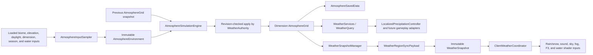

# Localized atmospheric weather foundation

## Purpose and current scope

The localized atmosphere is a server-authoritative, dimension-scoped weather
foundation. It replaces the vanilla global rain flag as the source of truth for
Wilderness-controlled weather while preserving vanilla global state by default
for compatibility. The first phase provides evolving atmospheric cells,
persistence, regional client synchronization, smooth local rain and snow,
localized sky/fog inputs, diagnostics, and read-only Wilderness water coupling.

This phase does not provide destructive storms, full volumetric clouds, local
lightning spawning, or a complete replacement for every vanilla gameplay rain
check. Those boundaries are intentional and are listed under
[Known limitations](#known-limitations-and-compatibility).

## Architecture



The principal ownership boundaries are:

- `WeatherAuthority` is the singular server authority. It schedules dimensions,
  captures inputs on the server thread, runs the pure engine, applies results by
  revision, and initiates synchronization.
- `AtmosphereGrid` owns mutable cells. Other systems receive only immutable
  `AtmosphereView` and `WeatherSample` values.
- `AtmosphereSavedData` owns one grid per dimension. Environment caches and all
  client rendering state are deliberately excluded from persistence.
- `WeatherSnapshotManager` sends server-to-client regional state. There is no
  client-to-server atmospheric-state payload.
- `ClientWeatherCoordinator` atomically publishes immutable client snapshots;
  rendering never reads live server state or mutable network DTOs.
- `WeatherServices.query()` is the stable server-side API. Consumers do not
  need to know cell coordinates, storage, scheduling, or payload details.

The first implementation is synchronous and throttled. World, chunk, biome,
registry, and water reads stay on the server thread. The engine accepts only
immutable inputs, and result application checks the cell revision, so its pure
calculation phase can move off-thread later without allowing stale work to
overwrite newer state.

## Atmospheric grid and units

Each dimension uses one horizontal grid. The default cell width is `256`
blocks, so one cell represents `256 x 256` columns; there is no per-block or
vertical atmospheric state. Block coordinates map with `floorDiv`, including
negative coordinates. Cell coordinates are packed into one `long` with signed
X in the high 32 bits and signed Z in the low 32 bits.

The public `WeatherSample` fields use these units and enforced ranges:

| Field | Unit and range | Meaning |
| --- | --- | --- |
| `temperature` | degrees Celsius, `[-80, 60]` | Local air temperature. |
| `humidity` | normalized `[0, 1]` | Relative vapor content. |
| `pressure` | normalized `[0.5, 1.5]`, centered on `1.0` | Local atmospheric pressure. |
| `wind.x`, `wind.z` | normalized components `[-1, 1]` | Horizontal transport direction and strength. |
| `cloudWater` | normalized `[0, 1]` | Condensed cloud moisture. |
| `instability` | normalized `[0, 1]` | Convective instability. |
| `stormEnergy` | normalized `[0, 1]` | Persistent severe-weather potential. |
| `precipitationIntensity` | normalized `[0, 1]` | Current local rain or snow strength. |
| `precipitationType` | `NONE`, `RAIN`, or `SNOW` | Current precipitation form. |

Each internal cell also owns a monotonically increasing revision,
`lastSimulatedTick`, and `lastActiveTick`. These values support safe result
application, delta synchronization, catch-up, diagnostics, and eviction.

Both server and client sample at cell centers and bilinearly interpolate the
four surrounding values. A missing edge neighbor reuses the nearest available
sample. This avoids square visible boundaries without creating cells merely to
answer a query. A region with no sample returns the immutable clear fallback.

Derived rendering/gameplay inputs are also centralized on `WeatherSample`:

```text
skyDarkening = clamp01(cloudWater * 0.35
                     + precipitationIntensity * 0.45
                     + stormEnergy * 0.35)

fogContribution = clamp01(max(0, humidity - 0.70) / 0.30 * 0.20
                        + cloudWater * 0.15
                        + precipitationIntensity * 0.40)

thunderIntensity = precipitationIntensity
                 * (stormEnergy * 0.70 + instability * 0.30)
```

Thunder is zero without precipitation. Lightning eligibility currently means
precipitation intensity at least `0.25`, storm energy at least `0.55`, and
derived thunder at least `0.35`; it is an API decision only and does not spawn
lightning in this phase.

## Environmental sampling

`AtmosphereInputSampler` captures compact environment inputs before invoking
the pure simulation engine.

- Terrain climate uses a deterministic `3 x 3` surface lattice per cell.
- Every lattice point calls `getChunkNow`; unavailable chunks are skipped and
  are never loaded for weather.
- Loaded samples use `WORLD_SURFACE`, biome modified temperature/downfall, and
  surface elevation. Minecraft biome temperature becomes Celsius using
  `(temperature - 0.15) * 25`. A biome without precipitation contributes one
  quarter of its downfall value.
- The terrain cache is least-recently-used, bounded to 2,048 cells, and
  refreshed after `environmentResampleIntervalTicks` (400 ticks by default).
  When a formerly sampled region is unloaded, the last known climate is kept
  instead of repeatedly polling or replacing it with a dry value.
- A cell with no loaded probes uses a dimension fallback: `38 C`, humidity
  `0.12` for ultra-warm dimensions; `12 C`, humidity `0.42` for ceiling
  dimensions; otherwise `15 C`, humidity `0.45`.
- Sky-light dimensions derive daylight continuously from day time. Dimensions
  without sky light use neutral `0.5` daylight. Ultra-warm dimensions add
  `20 C`; non-sky-light ceiling dimensions subtract `2 C`.
- `SeasonalWeatherInfluence` is an optional read-only adapter. The default is
  neutral and creates no hard season-mod dependency.
- Atmospheric variation is deterministic from world seed and packed cell key;
  there is no per-update random preset switching.

The environment temperature target is:

```text
targetTemperature = biomeTemperatureCelsius
                  + dimensionTemperatureOffset
                  + seasonalTemperatureOffset
                  + (daylight - 0.5) * 8
                  - (elevationBlocks - 64) * 0.0065
                  + deterministicVariation * randomVariation * 20
```

The configured `randomVariation` defaults to `0.04`. Elevation therefore cools
air by `0.65 C` per 100 blocks above Y 64, and daylight contributes from
`-4 C` to `+4 C`.

## Water coupling

Weather observes water through the `WeatherWaterInfluence` read-only boundary.
`WildernessWeatherWaterInfluence` uses `WaterServices.access().isWaterAt` for
the existing Wilderness authority and `FluidTags.WATER` as a vanilla/modded
fallback. It never imports, creates, removes, replaces, or otherwise mutates
water state.

For each atmospheric cell it samples a deterministic `8 x 8` surface lattice:

- only already-loaded chunks are considered through `getChunkNow`;
- each probe reads one `MOTION_BLOCKING` surface column;
- wet probes are classified as ocean, river, or inland from biome tags;
- Wilderness-owned and tagged-only water both contribute to total surface
  coverage; and
- results are immutable, cached for the environment refresh interval, and held
  in a separate 2,048-entry least-recently-used cache.

If no probe chunk is loaded, the result is `UNKNOWN` with a loaded fraction of
zero. A previously observed cell retains its last known water sample when all
probe chunks later unload. Moisture potential is calculated from normalized
loaded-probe coverage and weighted by the observed fraction, so one loaded wet
column cannot make an otherwise unknown cell appear fully wet:

```text
moisturePotential = clamp01((surfaceWaterCoverage * 0.55
                           + oceanCoverage * 0.35
                           + riverCoverage * 0.18
                           + inlandWaterCoverage * 0.10)
                          * loadedProbeFraction)
```

This aggregate becomes the environment's `waterCoverage`. Evaporation then
uses it without enumerating stored water positions:

```text
warmth = clamp((temperature + 10) / 45, 0.05, 1.0)
ventilation = clamp(0.6 + windMagnitude * 0.4, 0.6, 1.2)
evaporationPotential = clamp01((waterCoverage * 0.85 + biomeHumidity * 0.15)
                             * warmth * ventilation)
```

The built-in water shader separately consumes the camera's immutable local
weather sample for its rain, thunder, and sky-brightness uniforms. This is a
client rendering input and does not reverse the ownership direction.

## Simulation update flow and formulas

Let `s` be configured simulation speed. One nominal update uses:

```text
approach(current, target, fraction) = current + (target - current) * fraction
rate(r) = clamp01(r * s)
```

All result fields are canonicalized through the `WeatherSample` bounds. The
engine reads a frozen center sample, four frozen cardinal neighbors, and one
captured environment. Missing neighbors fall back to the center.

1. **Environmental heating and cooling**

   ```text
   temperature = approach(temperature, targetTemperature, rate(0.035))
   neighborTemperature = average(north, east, south, west)
   ```

2. **Pressure equalization and thermal pressure coupling**

   ```text
   neighborPressure = average(north, east, south, west)
   equalizedPressure = approach(pressure, neighborPressure,
                                rate(pressureEqualizationRate * 0.25))
   thermalDelta = (neighborTemperature - temperature)
                * 0.0025 * pressureEqualizationRate * s
   pressure = equalizedPressure + thermalDelta
   ```

3. **Pressure-driven wind**

   ```text
   targetWindX = (westPressure - eastPressure) * 4
   targetWindZ = (northPressure - southPressure) * 4
   windResponse = rate(0.12 + pressureEqualizationRate * 0.45)
   wind = approach(wind, targetWind, windResponse)
   ```

4. **Upwind transport**

   Positive X wind reads the west source and positive Z wind reads the north
   source. The two sources are weighted by absolute wind components. The
   transport fraction is `rate(configuredRate * min(1, windMagnitude))`.
   Temperature uses `temperatureTransportRate`, humidity uses
   `humidityTransportRate`, and cloud water uses
   `humidityTransportRate * 0.8`.

5. **Biome relaxation and evaporation**

   ```text
   humidity = approach(humidity, biomeHumidity, rate(0.02))
   evaporation = evaporationStrength * evaporationPotential
               * (1 - humidity) * 0.08 * s
   humidity = clamp01(humidity + evaporation)
   ```

6. **Condensation and cloud dissipation**

   ```text
   saturationThreshold = clamp(cloudFormationThreshold
                             + (temperature - 15) * 0.004,
                               0.20, 0.98)
   saturationExcess = max(0, humidity - saturationThreshold)
   condensation = min(humidity,
                      saturationExcess * 0.28
                      * (0.75 + previousInstability * 0.25) * s)
   humidity -= condensation
   cloudWater += condensation
   cloudWater = approach(cloudWater, 0,
                         rate(0.006 + (1 - humidity) * 0.008))
   ```

7. **Convective instability**

   ```text
   temperatureContrast = clamp01(abs(temperature - neighborTemperature) / 30)
   instabilityTarget = clamp01(humidity * 0.40
                             + temperatureContrast * 0.60)
   instability = approach(instability, instabilityTarget, rate(0.08))
   ```

8. **Storm-energy growth and decay**

   ```text
   lowPressureSupport = clamp01((1.04 - pressure) / 0.20)
   stormPotential = clamp01(humidity * instability
                          * (0.55 + lowPressureSupport * 0.45))
   ```

   If `stormPotential` exceeds `stormFormationThreshold`, storm energy gains
   `(stormPotential - threshold) * 0.12 * s`; otherwise it loses `0.025 * s`.

9. **Precipitation and moisture loss**

   When cloud water exceeds `precipitationThreshold`:

   ```text
   availableCloud = (cloudWater - precipitationThreshold)
                  / (1 - precipitationThreshold)
   precipitationTarget = clamp01(availableCloud)
                       * maximumPrecipitationIntensity
                       * (0.75 + stormEnergy * 0.25)
   precipitationIntensity = approach(previousIntensity,
                                     precipitationTarget,
                                     rate(0.35))

   loss = precipitationIntensity * 0.04
        * (1 + stormEnergy * 0.25) * s
   cloudWater -= loss
   humidity -= loss * 0.15
   ```

   Intensity at or below `0.001` becomes `NONE`. Otherwise temperature at or
   below `1.5 C` produces `SNOW`, and warmer air produces `RAIN`.

New cells initialize from their environmental temperature target, biome/water
humidity, temperature/elevation-adjusted pressure, and small bounded
instability. They begin without precipitation or storm energy; debug force
commands are the deterministic way to create immediate local test weather.

## Scheduling, activity, and catch-up

The authority runs after normal server tick work, but only simulates a
dimension when `gameTime` is divisible by `simulationIntervalTicks` (60 ticks
by default).

- Player activity is collected into one deduplicated set, so overlapping player
  regions do not simulate the same cell twice.
- The active radius includes one continuity/interpolation ring:
  `min(16, activeSimulationRadius + 1)`. With the default configured radius of
  two, this is a `7 x 7` cell region per isolated player.
- Active cells are created lazily, have their activity watermark advanced, and
  remain scheduled during the configured grace period (2,400 ticks by default).
- Existing cells with storm energy at least `0.55` remain scheduled as
  persistent storms even without a nearby player. Their already-retained
  north/east/south/west neighbors are also scheduled as a cardinal continuity
  halo. This halo does not create missing cells or load chunks.
- Dormant cells do no regular work. When scheduled again, catch-up is bounded to
  `min(12, max(1, elapsedTicks / simulationIntervalTicks))` engine steps. All
  catch-up steps use already captured immutable environment/neighborhood data.
- Every pass calculates from one frozen grid view. Results apply only if the
  cell revision still equals the captured revision, preventing a debug edit or
  future asynchronous result from being overwritten.
- Retention is bounded per dimension. Active cells are protected during trim;
  quiet, low-storm, least-recently-active cells are evicted first.

Changing the configured cell size clears retained atmospheric cells because
the old coordinates no longer represent the same world regions.

## Persistence format

Each dimension stores `wildernessodysseyapi_atmosphere` as NeoForge
`SavedData`. Schema version 1 contains:

| NBT key | Type | Content |
| --- | --- | --- |
| `dataVersion` | int | Schema version, currently `1`. |
| `cellSize` | int | Cell width used by the saved coordinates. |
| `cellKeys` | long array | Packed signed X/Z coordinates. |
| `weatherA` | long array | Temperature, humidity, pressure, wind X/Z. |
| `weatherB` | long array | Cloud water, instability, storm energy, precipitation, type. |
| `revisions` | long array | Monotonic cell revisions. |
| `lastSimulatedTicks` | long array | Simulation watermarks. |
| `lastActiveTicks` | long array | Activity watermarks. |

`weatherA` uses 16 bits for temperature, 12 for humidity, 16 for pressure,
and 10 each for wind X/Z. `weatherB` uses 12 bits each for cloud water,
instability, storm energy, and precipitation intensity, followed by two bits
for precipitation type. Remaining `weatherB` bits are reserved and must be
zero.

The codec writes at most `maxPersistedCells`. If selection is necessary, high
storm energy and recently active cells win; final output is sorted by packed
key for stable saves. Client transition state and environmental caches are not
saved.

Load recovery is fail-safe:

- absent or unsupported versions recover to an empty grid;
- invalid cell size falls back to the configured size;
- unequal parallel arrays use only their common valid prefix and count the
  remaining entries as skipped;
- negative revisions/ticks, duplicate keys, reserved bits, out-of-world keys,
  and invalid precipitation types are skipped;
- any unexpected runtime decode failure recovers to an empty grid; and
- applying a different configured cell size clears restored cells safely.

The data has no global dimension index. If a dimension is removed, its
dimension-scoped `SavedData` is simply never requested by the authority.

Malformed weather data therefore cannot prevent its dimension from loading.

## Regional synchronization

`WeatherRegionSyncPayload` is a one-way NeoForge play payload. The client has no
payload that can authoritatively edit weather; operator changes run as
permission-gated server commands through `WeatherAuthority`.

The synchronization radius is
`min(8, max(1, activeSimulationRadius + 1))`. The default is three cells, a
maximum of 49 populated entries. The hard wire limit is radius eight, or a
`17 x 17` region with at most 289 cells. The entire dimension grid is never
sent.

A complete replacement is sent after login, respawn/dimension invalidation,
cell-region movement (including teleportation), config invalidation, or an
observed regional cell removal. While the player remains in the same region,
only cells with changed revisions are sent. A no-change pass sends nothing.
Because schema version 1 has no deletion tombstone, a removal triggers a full
replacement. Disabling weather sends one explicit empty reset and then remains
silent until state changes again.

The payload header contains dimension, schema version, monotonic sequence,
enabled/replace flags, cell size, signed center coordinates, and count. Each
cell contains signed byte offsets from the center, revision, and these compact
values:

| Field | Wire representation |
| --- | --- |
| Temperature `[-80, 60]` | unsigned 16-bit fixed point |
| Humidity `[0, 1]` | unsigned 8-bit fixed point |
| Pressure `[0.5, 1.5]` | unsigned 16-bit fixed point |
| Wind X/Z `[-1, 1]` | signed 16-bit fixed point each |
| Cloud water, instability, storm energy | unsigned 8-bit fixed point each |
| Precipitation | one byte: two-bit type plus six-bit intensity |

The client rejects a payload with the wrong version, wrong active dimension,
invalid bounds, duplicate/out-of-region cells, or a sequence at or below its
per-dimension watermark. Network state is copied into a new complete immutable
map and published atomically. Full payloads replace; deltas merge only newer
cell revisions. Login/logout clears all snapshots and sequence watermarks, and
dimension unload clears the displayed region.

Spatial interpolation occurs across neighboring cell centers. A two-second
temporal blend interpolates from the currently displayed state to each accepted
snapshot, including precipitation, wind, and sky/fog inputs. Snapshot maps are
rebuilt only when a payload arrives, not every frame. The per-column rain/snow
classification path interpolates primitive temperature/intensity values and
the authoritative categorical type from a primitive-keyed snapshot map,
avoiding temporary `WeatherSample` records in vanilla's high-frequency
precipitation render loop.

## Localized precipitation rendering

Two narrow client mixins integrate with vanilla rendering without globally
overriding `ClientLevel` weather getters:

- `LevelRendererLocalizedWeatherMixin` redirects the rain intensity and biome
  precipitation decisions only inside `renderSnowAndRain` and `tickRain`.
  Vanilla rain/snow quads, particles, and precipitation sounds therefore use
  local intensity. Type is sampled at each rendered block, while the overall
  intensity comes from the local player/camera sample.
- `ClientLevelLocalizedWeatherMixin` redirects rain/thunder reads only inside
  sky darkness, sky color, and cloud color calculations. It uses localized
  sky-darkening and thunder contributions.

When no valid snapshot controls the current dimension, both mixins immediately
fall back to vanilla values. Other mods and gameplay code that call global
`ClientLevel.getRainLevel`, `getThunderLevel`, `isRaining`, or `isThundering`
are intentionally not changed.

`WeatherClientEvents` blends only air-camera fog. It leaves water, lava, and
powder-snow fog to their existing owners. Weather haze shifts fog toward a
storm-neutral color and shortens the far plane, never below 24 blocks. The
Wilderness built-in ocean shader also receives local rain/thunder uniforms at
the camera when snapshots are active.

The F3 overlay adds four `WO Atmosphere` lines with cell, sequence, synchronized
cell count, blend progress, temperature, humidity, pressure, wind, cloud water,
instability, storm energy, precipitation, thunder, and fog. Server activity
state remains available through `/wilderness weather cell` and `dump` rather
than adding activity metadata to every client cell.

## Server configuration

The server config is registered as
`wildernessodysseyapi/wildernessodysseyapi-weather-server.toml`. Values are
validated by NeoForge and copied into immutable scheduling/simulation records.

| Config path under `weather` | Default | Allowed range or behavior |
| --- | ---: | --- |
| `enabled` | `true` | Master switch. |
| `atmosphericCellSize` | `256` | `16..4096` blocks; changing it resets stored cells. |
| `simulationIntervalTicks` | `60` | `10..1200`. |
| `activeSimulationRadius` | `2` | `0..16` cells; authority adds a continuity ring where possible. |
| `inactiveCellGracePeriodTicks` | `2400` | `0..1728000`. |
| `environmentResampleIntervalTicks` | `400` | `20..72000`. |
| `snapshotSyncIntervalTicks` | `60` | `5..1200`. |
| `maxPersistedCells` | `4096` | `64..65536` per dimension. |
| `simulation.speed` | `1.0` | `0..8`; zero freezes evolution without deleting state. |
| `simulation.humidityTransportRate` | `0.18` | `0..1`. |
| `simulation.temperatureTransportRate` | `0.10` | `0..1`. |
| `simulation.pressureEqualizationRate` | `0.20` | `0..1`. |
| `simulation.evaporationStrength` | `0.12` | `0..1`. |
| `simulation.cloudFormationThreshold` | `0.72` | `0.05..0.99`. |
| `simulation.precipitationThreshold` | `0.58` | `0.05..0.99`. |
| `simulation.stormFormationThreshold` | `0.42` | `0..1`. |
| `simulation.maximumPrecipitationIntensity` | `1.0` | `0..1`. |
| `simulation.randomVariation` | `0.04` | `0..0.25`, deterministic by cell. |
| `compatibility.dimensionAllowlist` | empty | Empty permits all dimensions not denied. |
| `compatibility.dimensionDenylist` | empty | Deny entries override allow entries. |
| `compatibility.vanillaWeatherCompatibilityMode` | `PRESERVE_GLOBAL` | `PRESERVE_GLOBAL` or `SUPPRESS_GLOBAL`. |
| `debugLogging` | `false` | Logs concise counts on simulation passes that meet the 1,200-tick diagnostics boundary. |

Dimension identifiers are normalized, deduplicated, and validated resource
locations. A config reload clears environment caches and marks tracked players
for complete regional snapshots.

## Commands and diagnostics

All weather commands require permission level 2:

```text
/wilderness weather sample
/wilderness weather cell
/wilderness weather set humidity <0..1>
/wilderness weather set pressure <0.5..1.5>
/wilderness weather set temperature <-80..60>
/wilderness weather set storm_energy <0..1>
/wilderness weather force rain
/wilderness weather force snow
/wilderness weather clear
/wilderness weather dump
```

`sample` reports the interpolated sample at the command source. `cell` reports
the containing cell's revision/ticks and `ACTIVE`, `GRACE`, `PERSISTENT_STORM`,
or `DORMANT` scheduling state. Scalar setters edit one cell. `force` and
`clear` affect the local `3 x 3` cell area and immediately dirty persistence
and client synchronization. `dump` summarizes retained and scheduled state.
Normal play produces no weather log spam unless `debugLogging` is enabled.

## Performance characteristics and risks

The current implementation deliberately avoids the expensive failure modes of
a block-scale weather system:

- state is one compact cell per large horizontal region, not per block;
- simulation is interval-driven, not per tick;
- nearby players share a deduplicated active-cell set;
- only active, grace-period, and persistent-storm cells evolve;
- environment and water reads use fixed lattices, bounded caches, and loaded
  chunks only;
- retained cells are bounded and least-valuable dormant cells are evicted;
- persistence uses primitive arrays and fixed-point weather words;
- each client receives only a bounded nearby region and changed revisions;
- client state copies occur on payload receipt rather than every frame; and
- per-column precipitation type queries use allocation-light scalar interpolation;
- all world reads are server-thread confined.

Remaining first-phase risks are bounded but worth profiling. Each simulation
pass currently copies retained immutable views into temporary maps/lists, so a
very high `maxPersistedCells` combined with many active dimensions can create
allocation pressure. Catch-up repeats at most 12 pure steps using one captured
neighbor/environment window, which is safe and cheap but only an approximation
of the missed timeline. The two 2,048-entry environment caches can churn on a
server that rotates rapidly through many distant cells. Simulation is still on
the server thread, so aggressive radius, interval, or speed settings should be
profiled before production use.

## Known limitations and compatibility

`PRESERVE_GLOBAL` is the default. Local snapshots own Wilderness client rain,
snow, precipitation sound, sky, fog, and built-in water-shader inputs, while
the vanilla global rain/thunder state continues to exist for compatibility.
This is currently necessary because Riftfall systems, Riftfall client effects,
several Rift entities, vanilla gameplay, and other mods still query global
`isRaining`/`isThundering` state.

The consequence is deliberate but visible: localized weather can disagree
with global gameplay. Vanilla fire extinguishing, cauldron filling, farmland,
crops, snow/freezing, fishing, mob spawning/behavior, lightning, and other
weather-aware logic have not yet migrated to `LocalizedPrecipitationController`.
A vanilla global storm can affect those systems even where the localized view
is clear, and a localized storm does not yet trigger all of them.

`SUPPRESS_GLOBAL` clears active vanilla rain/thunder through server weather
parameters while keeping localized rendering. This removes the compatibility
fallback; current Riftfall and other global-weather consumers will stop seeing
rain. It should be enabled only after those consumers are migrated or when that
behavior is desired.

Additional first-phase limits:

- local thunder is a derived render/API contribution; no localized lightning
  scheduler, strike synchronization, or thunder event metadata exists yet;
- `LocalizedPrecipitationController` exposes safe decisions for wetting,
  hydration, lightning eligibility, visibility, and temperature, but it is not
  wired into every vanilla interaction;
- fronts move only through the current cardinal transport of continuous cell
  fields; there is no explicit front object, storm merge identity, or distant
  storm metadata;
- the client uses vanilla precipitation geometry and sound logic, not rain
  shafts, custom cloud layers, or volumetric clouds;
- a custom renderer that entirely replaces vanilla `LevelRenderer` weather
  methods may need its own adapter to consume `ClientWeatherCoordinator`;
- seasons, anomaly moisture, contaminated rain, drought, lake-effect snow,
  external weather mods, radar, destructive wind, tornadoes, cyclones,
  hurricanes, and block damage are not implemented; and
- no code, shader, texture, asset, or implementation detail is copied from an
  external weather mod, and none is a hard dependency.

## In-game validation checklist

Use JDK 21 and build first:

```powershell
.\gradlew.bat build
.\gradlew.bat runClient
```

For multiplayer validation, run a dedicated development server and connect two
clients with permission level 2. Keep the default 256-block cells unless a test
explicitly changes them; changing size resets atmospheric state.

1. **Inspect the baseline.** Join, open F3, and confirm the four
   `WO Atmosphere` lines appear after the first sync. Run
   `/wilderness weather sample`, `/wilderness weather cell`, and
   `/wilderness weather dump`. Confirm the command values match the local F3
   sample within network quantization and the two-second client blend.
2. **Verify rain and snow rendering.** Run
   `/wilderness weather force rain`; confirm local rain quads, particles,
   precipitation sounds, sky darkening, and air fog. Run
   `/wilderness weather force snow`; confirm snow replaces rain. Run
   `/wilderness weather clear` and confirm both stop after synchronization and
   blending.
3. **Verify two local conditions.** Place player A inside a forced `3 x 3`
   region and player B at least three cells away (roughly 768 blocks at the
   default size), but in the same dimension. Force rain at A and clear at B.
   Confirm A sees rain while B remains clear. Move both clients to the same
   block and confirm their F3 weather fields agree.
4. **Verify continuous evolution and transport.** Force rain, then use
   `/execute positioned <x> <y> <z> run wilderness weather set pressure 0.7`
   in one cell and pressure `1.3` in an adjacent cell. Set humidity near `1.0`
   where needed. Wait several 60-tick simulation intervals and sample both
   cells repeatedly. Confirm wind develops from the pressure gradient and
   temperature, humidity, cloud water, and precipitation change smoothly rather
   than switching presets. Walk across the boundary and confirm interpolation
   has no hard square edge.
5. **Verify restart persistence.** Force weather, record `sample` and `cell`,
   run `/save-all flush`, stop cleanly, restart, and return to the same
   coordinates. Confirm the cell revision/state and weather continuity survive;
   allow for fixed-point save precision and elapsed simulation.
6. **Verify chunk-load safety.** With players stationary, record the server's
   loaded-chunk count using the development server/F3 or the pack's normal chunk
   profiler. Wait through multiple environment refreshes (more than 400 ticks).
   Confirm the loaded region does not expand in an atmospheric-cell pattern.
   Move into a new region and confirm sampling skips unavailable probes rather
   than creating distant chunk tickets.
7. **Verify dimension synchronization.** Enter another dimension and confirm
   F3 changes to that dimension's new regional sequence/state. Return and
   confirm the original dimension state is resynchronized. Repeat with a
   same-dimension teleport across at least one atmospheric-cell boundary.
8. **Verify reconnect behavior.** Disconnect during forced weather, reconnect,
   and confirm the first full snapshot restores the correct local visuals and
   F3 sample. Confirm stale state from the previous connection or dimension is
   not briefly used.
9. **Verify water is read-only.** At an ocean/river/lake, record
   `/wowater inspect` and `/wowater authority 16`, then record nearby weather
   humidity. Wait through an environment refresh and repeat. Confirm wet
   regions contribute moisture over time while the water ownership/coverage
   diagnostics and blocks are unchanged by weather.
10. **Verify every debug edit.** Exercise all scalar setters, `force rain`,
    `force snow`, `clear`, and `dump` as an operator. Confirm a non-operator is
    denied. Confirm edits increment the cell revision and appear on connected
    clients at the next synchronization pass.
11. **Verify disable/reset behavior.** Set `weather.enabled=false` in the
    server config and reload/restart. Confirm clients receive an empty reset,
    the F3 atmosphere lines disappear, rendering falls back safely to vanilla,
    and server weather queries return clear. Re-enable it and confirm a complete
    regional snapshot resumes. Test both compatibility modes separately if the
    pack intends to use `SUPPRESS_GLOBAL`.
12. **Verify multiplayer authority.** Put both clients at the same coordinates,
    issue edits from the server/operator, and compare F3/sample values. Confirm
    both converge on the same server-authored fields, clients cannot create
    weather locally, and rapid movement/reconnect does not make an older payload
    replace a newer sequence.

## Extension points and recommended next phase

The next phase should deepen the same boundaries rather than replace them:

1. Improve front propagation with explicit conservative neighbor flux or a
   semi-Lagrangian transport pass, an advection-aware expansion of the existing
   retained-cell cardinal storm halo, and tests for translation, strengthening,
   merging, and dissipation. Keep calculation pure and apply by revision.
2. Add server-owned thunderstorm metadata and a localized lightning scheduler
   using `lightningEligible`, exposure, cooldowns, and bounded strike regions.
   Synchronize only nearby strike/event metadata; never let clients request
   authoritative strikes.
3. Migrate gameplay one adapter at a time through
   `LocalizedPrecipitationController`, starting with Riftfall, fire/wetness,
   cauldrons, farmland, snow/freezing, and fishing. Once global consumers are
   removed, reassess making suppression the default.
4. Build layered/distant clouds, rain shafts, fog banks, and storm-front visuals
   as client consumers of `ClientWeatherCoordinator`. Start with instanced
   layers and quality settings; treat volumetric/compute rendering as an
   optional later tier, not part of server authority.
5. Extend the existing `WeatherWaterInfluence` and
   `SeasonalWeatherInfluence` boundaries for lake-effect snow, ocean-fed storm
   development, seasons, drought, contamination, and anomaly weather without
   giving weather mutable access to water or third-party systems.
6. Profile multi-dimension/high-player workloads before increasing active
   radii. If needed, move only immutable engine calculations to workers while
   retaining capture and revision-checked apply on the server thread.
