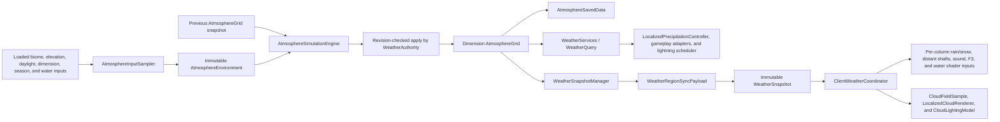

# Localized atmospheric weather foundation

## Purpose and current scope

The localized atmosphere is a server-authoritative, dimension-scoped weather
foundation. It replaces the vanilla global rain flag as the source of truth for
Wilderness-controlled weather while preserving vanilla global state by default
for compatibility. The implemented phases provide evolving atmospheric cells,
persistence, regional client synchronization, per-column rain and snow,
Minecraft-style functional cloud masses and distant rain curtains, overhead
cloud optics, localized natural lightning, position-aware gameplay rain,
diagnostics, and read-only Wilderness water coupling.

The system does not provide destructive storms, volumetric clouds, projected
per-block cloud shadows, or a complete replacement for every global vanilla
weather consumer. The cloud layer deliberately remains blocky and uses
Minecraft's cloud pipeline rather than becoming a realistic particle volume.
Those boundaries are intentional and are listed under
[Known limitations](#known-limitations-and-compatibility).

## Architecture



The principal ownership boundaries are:

- `WeatherAuthority` is the singular server authority. It schedules dimensions,
  captures inputs on the server thread, runs the pure engine, applies results by
  revision, and initiates synchronization.
- `AtmosphereGrid` owns mutable cells. Other systems receive only immutable
  `AtmosphereView` and `WeatherSample` values.
- `AtmosphereSavedData` owns one grid per dimension. Environment caches and all
  client rendering state are deliberately excluded from persistence.
- `WeatherSnapshotManager` sends server-to-client regional state. There is no
  client-to-server atmospheric-state payload.
- `ClientWeatherCoordinator` atomically publishes immutable client snapshots;
  rendering never reads live server state or mutable network DTOs.
- `WeatherServices.query()` is the stable server-side API. Consumers do not
  need to know cell coordinates, storage, scheduling, or payload details.
- Each level runtime owns one bounded `LocalizedLightningScheduler`; clients
  receive the resulting vanilla lightning entity and never request a strike.

The first implementation is synchronous and throttled. World, chunk, biome,
registry, and water reads stay on the server thread. The engine accepts only
immutable inputs, and result application checks the cell revision, so its pure
calculation phase can move off-thread later without allowing stale work to
overwrite newer state.

## Atmospheric grid and units

Each dimension uses one horizontal grid. The default cell width is `256`
blocks, so one cell represents `256 x 256` columns; there is no per-block or
vertical atmospheric state. Block coordinates map with `floorDiv`, including
negative coordinates. Cell coordinates are packed into one `long` with signed
X in the high 32 bits and signed Z in the low 32 bits.

The public `WeatherSample` fields use these units and enforced ranges:

| Field | Unit and range | Meaning |
| --- | --- | --- |
| `temperature` | degrees Celsius, `[-80, 60]` | Local air temperature. |
| `humidity` | normalized `[0, 1]` | Relative vapor content. |
| `pressure` | normalized `[0.5, 1.5]`, centered on `1.0` | Local atmospheric pressure. |
| `wind.x`, `wind.z` | normalized components `[-1, 1]` | Horizontal transport direction and strength. |
| `cloudWater` | normalized `[0, 1]` | Condensed cloud moisture. |
| `instability` | normalized `[0, 1]` | Convective instability. |
| `stormEnergy` | normalized `[0, 1]` | Persistent severe-weather potential. |
| `precipitationIntensity` | normalized `[0, 1]` | Current local rain or snow strength. |
| `precipitationType` | `NONE`, `RAIN`, or `SNOW` | Current precipitation form. |

Each internal cell also owns a monotonically increasing revision,
`lastSimulatedTick`, and `lastActiveTick`. These values support safe result
application, delta synchronization, catch-up, diagnostics, and eviction.

Both server and client sample at cell centers and bilinearly interpolate the
four surrounding values. A missing edge neighbor reuses the nearest available
sample. This avoids square visible boundaries without creating cells merely to
answer a query. A region with no sample returns the immutable clear fallback.

Cloud geometry uses a separate support-aware interpolation path. It blends the
same four synchronized cells but also records how much of the bilinear sample
is backed by received data. Missing cells therefore reduce support and fade the
cloud field at the edge of the synchronized region instead of stretching the
last cloud cell indefinitely.

Derived rendering/gameplay inputs are also centralized on `WeatherSample`:

```text
skyDarkening = clamp01(cloudWater * 0.35
                     + precipitationIntensity * 0.45
                     + stormEnergy * 0.35)

fogContribution = clamp01(max(0, humidity - 0.70) / 0.30 * 0.20
                        + cloudWater * 0.15
                        + precipitationIntensity * 0.40)

thunderIntensity = precipitationIntensity
                 * (stormEnergy * 0.70 + instability * 0.30)
```

Thunder is zero without precipitation. Lightning eligibility currently means
precipitation intensity at least `0.25`, storm energy at least `0.55`, and
derived thunder at least `0.35`. The localized lightning scheduler combines
that eligibility with loaded-chunk, exposure, probability, and cooldown checks
before creating a vanilla bolt.

## Environmental sampling

`AtmosphereInputSampler` captures compact environment inputs before invoking
the pure simulation engine.

- Terrain climate uses a deterministic `3 x 3` surface lattice per cell.
- Every lattice point calls `getChunkNow`; unavailable chunks are skipped and
  are never loaded for weather.
- Loaded samples use `WORLD_SURFACE`, biome modified temperature/downfall, and
  surface elevation. Minecraft biome temperature becomes Celsius using
  `(temperature - 0.15) * 25`. A biome without precipitation contributes one
  quarter of its downfall value.
- The terrain cache is least-recently-used, bounded to 2,048 cells, and
  refreshed after `environmentResampleIntervalTicks` (400 ticks by default).
  When a formerly sampled region is unloaded, the last known climate is kept
  instead of repeatedly polling or replacing it with a dry value.
- A cell with no loaded probes uses a dimension fallback: `38 C`, humidity
  `0.12` for ultra-warm dimensions; `12 C`, humidity `0.42` for ceiling
  dimensions; otherwise `15 C`, humidity `0.45`.
- Sky-light dimensions derive daylight continuously from day time. Dimensions
  without sky light use neutral `0.5` daylight. Ultra-warm dimensions add
  `20 C`; non-sky-light ceiling dimensions subtract `2 C`.
- `SeasonalWeatherInfluence` is an optional read-only adapter. The default is
  neutral and creates no hard season-mod dependency.
- Atmospheric variation is deterministic from world seed and packed cell key;
  there is no per-update random preset switching.

The environment temperature target is:

```text
targetTemperature = biomeTemperatureCelsius
                  + dimensionTemperatureOffset
                  + seasonalTemperatureOffset
                  + (daylight - 0.5) * 8
                  - (elevationBlocks - 64) * 0.0065
                  + deterministicVariation * randomVariation * 20
```

The configured `randomVariation` defaults to `0.04`. Elevation therefore cools
air by `0.65 C` per 100 blocks above Y 64, and daylight contributes from
`-4 C` to `+4 C`.

## Water coupling

Weather observes water through the `WeatherWaterInfluence` read-only boundary.
`WildernessWeatherWaterInfluence` uses `WaterServices.access().isWaterAt` for
the existing Wilderness authority and `FluidTags.WATER` as a vanilla/modded
fallback. It never imports, creates, removes, replaces, or otherwise mutates
water state.

For each atmospheric cell it samples a deterministic `8 x 8` surface lattice:

- only already-loaded chunks are considered through `getChunkNow`;
- each probe reads one `MOTION_BLOCKING` surface column;
- wet probes are classified as ocean, river, or inland from biome tags;
- Wilderness-owned and tagged-only water both contribute to total surface
  coverage; and
- results are immutable, cached for the environment refresh interval, and held
  in a separate 2,048-entry least-recently-used cache.

If no probe chunk is loaded, the result is `UNKNOWN` with a loaded fraction of
zero. A previously observed cell retains its last known water sample when all
probe chunks later unload. Moisture potential is calculated from normalized
loaded-probe coverage and weighted by the observed fraction, so one loaded wet
column cannot make an otherwise unknown cell appear fully wet:

```text
moisturePotential = clamp01((surfaceWaterCoverage * 0.55
                           + oceanCoverage * 0.35
                           + riverCoverage * 0.18
                           + inlandWaterCoverage * 0.10)
                          * loadedProbeFraction)
```

This aggregate becomes the environment's `waterCoverage`. Evaporation then
uses it without enumerating stored water positions:

```text
warmth = clamp((temperature + 10) / 45, 0.05, 1.0)
ventilation = clamp(0.6 + windMagnitude * 0.4, 0.6, 1.2)
evaporationPotential = clamp01((waterCoverage * 0.85 + biomeHumidity * 0.15)
                             * warmth * ventilation)
```

The built-in water shader separately consumes the camera's immutable local
weather sample for its rain, thunder, and sky-brightness uniforms. This is a
client rendering input and does not reverse the ownership direction.

## Simulation update flow and formulas

Let `s` be configured simulation speed. One nominal update uses:

```text
approach(current, target, fraction) = current + (target - current) * fraction
rate(r) = clamp01(r * s)
```

All result fields are canonicalized through the `WeatherSample` bounds. The
engine reads a frozen center sample, four frozen cardinal neighbors, and one
captured environment. Missing neighbors fall back to the center.

1. **Environmental heating and cooling**

   ```text
   temperature = approach(temperature, targetTemperature, rate(0.035))
   neighborTemperature = average(north, east, south, west)
   ```

2. **Pressure equalization and thermal pressure coupling**

   ```text
   neighborPressure = average(north, east, south, west)
   equalizedPressure = approach(pressure, neighborPressure,
                                rate(pressureEqualizationRate * 0.25))
   thermalDelta = (neighborTemperature - temperature)
                * 0.0025 * pressureEqualizationRate * s
   pressure = equalizedPressure + thermalDelta
   ```

3. **Pressure-driven wind**

   ```text
   targetWindX = (westPressure - eastPressure) * 4
   targetWindZ = (northPressure - southPressure) * 4
   windResponse = rate(0.12 + pressureEqualizationRate * 0.45)
   wind = approach(wind, targetWind, windResponse)
   ```

4. **Upwind transport**

   Positive X wind reads the west source and positive Z wind reads the north
   source. The two sources are weighted by absolute wind components. The
   transport fraction is `rate(configuredRate * min(1, windMagnitude))`.
   Temperature uses `temperatureTransportRate`, humidity uses
   `humidityTransportRate`, and cloud water uses
   `humidityTransportRate * 0.8`.

5. **Biome relaxation and evaporation**

   ```text
   humidity = approach(humidity, biomeHumidity, rate(0.02))
   evaporation = evaporationStrength * evaporationPotential
               * (1 - humidity) * 0.08 * s
   humidity = clamp01(humidity + evaporation)
   ```

6. **Condensation and cloud dissipation**

   ```text
   saturationThreshold = clamp(cloudFormationThreshold
                             + (temperature - 15) * 0.004,
                               0.20, 0.98)
   saturationExcess = max(0, humidity - saturationThreshold)
   condensation = min(humidity,
                      saturationExcess * 0.28
                      * (0.75 + previousInstability * 0.25) * s)
   humidity -= condensation
   cloudWater += condensation
   cloudWater = approach(cloudWater, 0,
                         rate(0.006 + (1 - humidity) * 0.008))
   ```

7. **Convective instability**

   ```text
   temperatureContrast = clamp01(abs(temperature - neighborTemperature) / 30)
   instabilityTarget = clamp01(humidity * 0.40
                             + temperatureContrast * 0.60)
   instability = approach(instability, instabilityTarget, rate(0.08))
   ```

8. **Storm-energy growth and decay**

   ```text
   lowPressureSupport = clamp01((1.04 - pressure) / 0.20)
   stormPotential = clamp01(humidity * instability
                          * (0.55 + lowPressureSupport * 0.45))
   ```

   If `stormPotential` exceeds `stormFormationThreshold`, storm energy gains
   `(stormPotential - threshold) * 0.12 * s`; otherwise it loses `0.025 * s`.

9. **Precipitation and moisture loss**

   When cloud water exceeds `precipitationThreshold`:

   ```text
   availableCloud = (cloudWater - precipitationThreshold)
                  / (1 - precipitationThreshold)
   precipitationTarget = clamp01(availableCloud)
                       * maximumPrecipitationIntensity
                       * (0.75 + stormEnergy * 0.25)
   precipitationIntensity = approach(previousIntensity,
                                     precipitationTarget,
                                     rate(0.35))

   loss = precipitationIntensity * 0.04
        * (1 + stormEnergy * 0.25) * s
   cloudWater -= loss
   humidity -= loss * 0.15
   ```

   Intensity at or below `0.001` becomes `NONE`. Otherwise temperature at or
   below `1.5 C` produces `SNOW`, and warmer air produces `RAIN`.

New cells initialize from their environmental temperature target, biome/water
humidity, temperature/elevation-adjusted pressure, and small bounded
instability. They begin without precipitation or storm energy; debug force
commands are the deterministic way to create immediate local test weather.

## Scheduling, activity, and catch-up

The authority runs after normal server tick work, but only simulates a
dimension when `gameTime` is divisible by `simulationIntervalTicks` (60 ticks
by default).

- Player activity is collected into one deduplicated set, so overlapping player
  regions do not simulate the same cell twice.
- The active radius includes one continuity/interpolation ring:
  `min(16, activeSimulationRadius + 1)`. With the default configured radius of
  two, this is a `7 x 7` cell region per isolated player.
- Active cells are created lazily, have their activity watermark advanced, and
  remain scheduled during the configured grace period (2,400 ticks by default).
- Existing cells with storm energy at least `0.55` remain scheduled as
  persistent storms even without a nearby player. Their already-retained
  north/east/south/west neighbors are also scheduled as a cardinal continuity
  halo. This halo does not create missing cells or load chunks.
- Dormant cells do no regular work. When scheduled again, catch-up is bounded to
  `min(12, max(1, elapsedTicks / simulationIntervalTicks))` engine steps. All
  catch-up steps use already captured immutable environment/neighborhood data.
- Every pass calculates from one frozen grid view. Results apply only if the
  cell revision still equals the captured revision, preventing a debug edit or
  future asynchronous result from being overwritten.
- Retention is bounded per dimension. Active cells are protected during trim;
  quiet, low-storm, least-recently-active cells are evicted first.

Changing the configured cell size clears retained atmospheric cells because
the old coordinates no longer represent the same world regions.

## Persistence format

Each dimension stores `wildernessodysseyapi_atmosphere` as NeoForge
`SavedData`. Schema version 1 contains:

| NBT key | Type | Content |
| --- | --- | --- |
| `dataVersion` | int | Schema version, currently `1`. |
| `cellSize` | int | Cell width used by the saved coordinates. |
| `cellKeys` | long array | Packed signed X/Z coordinates. |
| `weatherA` | long array | Temperature, humidity, pressure, wind X/Z. |
| `weatherB` | long array | Cloud water, instability, storm energy, precipitation, type. |
| `revisions` | long array | Monotonic cell revisions. |
| `lastSimulatedTicks` | long array | Simulation watermarks. |
| `lastActiveTicks` | long array | Activity watermarks. |

`weatherA` uses 16 bits for temperature, 12 for humidity, 16 for pressure,
and 10 each for wind X/Z. `weatherB` uses 12 bits each for cloud water,
instability, storm energy, and precipitation intensity, followed by two bits
for precipitation type. Remaining `weatherB` bits are reserved and must be
zero.

The codec writes at most `maxPersistedCells`. If selection is necessary, high
storm energy and recently active cells win; final output is sorted by packed
key for stable saves. Client transition state and environmental caches are not
saved.

Load recovery is fail-safe:

- absent or unsupported versions recover to an empty grid;
- invalid cell size falls back to the configured size;
- unequal parallel arrays use only their common valid prefix and count the
  remaining entries as skipped;
- negative revisions/ticks, duplicate keys, reserved bits, out-of-world keys,
  and invalid precipitation types are skipped;
- any unexpected runtime decode failure recovers to an empty grid; and
- applying a different configured cell size clears restored cells safely.

The data has no global dimension index. If a dimension is removed, its
dimension-scoped `SavedData` is simply never requested by the authority.

Malformed weather data therefore cannot prevent its dimension from loading.

## Regional synchronization

`WeatherRegionSyncPayload` is a one-way NeoForge play payload. The client has no
payload that can authoritatively edit weather; operator changes run as
permission-gated server commands through `WeatherAuthority`.

The synchronization radius is
`min(8, max(1, activeSimulationRadius + 1))`. The default is three cells, a
maximum of 49 populated entries. The hard wire limit is radius eight, or a
`17 x 17` region with at most 289 cells. The entire dimension grid is never
sent.

A complete replacement is sent after login, respawn/dimension invalidation,
cell-region movement (including teleportation), config invalidation, or an
observed regional cell removal. While the player remains in the same region,
only cells with changed revisions are sent. A no-change pass sends nothing.
Because schema version 1 has no deletion tombstone, a removal triggers a full
replacement. Disabling weather sends one explicit empty reset and then remains
silent until state changes again.

The payload header contains dimension, schema version, monotonic sequence,
enabled/replace flags, cell size, signed center coordinates, and count. Each
cell contains signed byte offsets from the center, revision, and these compact
values:

| Field | Wire representation |
| --- | --- |
| Temperature `[-80, 60]` | unsigned 16-bit fixed point |
| Humidity `[0, 1]` | unsigned 8-bit fixed point |
| Pressure `[0.5, 1.5]` | unsigned 16-bit fixed point |
| Wind X/Z `[-1, 1]` | signed 16-bit fixed point each |
| Cloud water, instability, storm energy | unsigned 8-bit fixed point each |
| Precipitation | one byte: two-bit type plus six-bit intensity |

Gameplay precipitation uses the same six-bit rounding as this payload. Server
physical queries quantize each cell endpoint before spatial interpolation,
matching the client's decode-then-interpolate order. Bucket `2` (`2 / 63`) is
the first functional rain/snow value, so a raw server field cannot become wet
on only one side of the connection.

The client rejects a payload with the wrong version, wrong active dimension,
invalid bounds, duplicate/out-of-region cells, or a sequence at or below its
per-dimension watermark. Network state is copied into a new complete immutable
map and published atomically. Full payloads replace; deltas merge only newer
cell revisions. Login/logout clears all snapshots and sequence watermarks, and
dimension unload clears the displayed region.

Spatial interpolation occurs across neighboring cell centers. A two-second
temporal blend interpolates from the currently displayed state to each accepted
snapshot, including precipitation, wind, and sky/fog inputs. Snapshot maps are
rebuilt only when a payload arrives, not every frame. The per-column rain/snow
classification path interpolates primitive temperature/intensity values and
the authoritative categorical type from a primitive-keyed snapshot map,
avoiding temporary `WeatherSample` records in vanilla's high-frequency
precipitation render loop.

## Localized precipitation rendering

Two narrow client mixins integrate with vanilla rendering without globally
overriding `ClientLevel` weather getters:

- `LevelRendererLocalizedWeatherMixin` wraps the dimension weather ownership
  hooks inside `renderSnowAndRain` and `tickRain`. Dimension-specific renderers
  run first; `LocalizedPrecipitationRenderer` replaces only vanilla's fallback.
  Every near rain/snow column receives its own intensity and type, so a dry
  camera no longer hides a neighboring rain edge. Splash particles and sounds
  use the same per-column field.
- `ClientLevelLocalizedWeatherMixin` redirects rain/thunder reads only inside
  sky darkness, sky color, and cloud color calculations. It uses localized
  sky-darkening and thunder contributions.

When no valid snapshot controls the current dimension, both mixins immediately
fall back to vanilla values. Other mods and gameplay code that call global
`ClientLevel.getRainLevel`, `getThunderLevel`, `isRaining`, or `isThundering`
are intentionally not changed.

`WeatherClientEvents` blends only air-camera fog. It leaves water, lava, and
powder-snow fog to their existing owners. Weather haze shifts fog toward a
storm-neutral color and normally uses a 32-block weather floor. If Blindness,
Darkness, or another renderer already supplies a shorter far plane, local
weather preserves that denser fog instead of lengthening it. The Wilderness
built-in ocean shader also receives local rain/thunder uniforms at the camera
when snapshots are active.

### Localized cloud rendering

`LevelRendererLocalizedWeatherMixin` wraps only vanilla's dimension-cloud
fallback. A dimension's own custom cloud renderer is allowed to run first. If
it declines and a synchronized Wilderness weather snapshot controls the level,
`LocalizedCloudRenderer` draws the localized field and suppresses vanilla's
global cloud sheet. With no controlling snapshot, disabled localized clouds,
or a dimension without a cloud height, rendering falls back safely.

The renderer keeps Minecraft's recognizable cloud language:

- the horizontal grid is made from `12 x 12` block cloud voxels, matching
  vanilla's cloud scale;
- **Fancy** clouds are solid block masses with exposed top, bottom, and side
  faces and discrete heights of 4, 8, or 12 blocks as precipitation and
  convection strengthen;
- **Fast** clouds use one flat quad for each occupied voxel; and
- both modes use vanilla `RenderType.clouds`, the active cloud texture,
  Minecraft fog/color state, and the normal Fancy depth-only pass.

Cloud placement is functional rather than decorative. Every voxel samples the
server-authored cloud water, precipitation, storm energy, instability, and wind
at its real world position. It also checks the tile endpoints and every
atmospheric interpolation knot inside the `12 x 12` footprint; because each
subregion is bilinear, these at-most-nine probes prove whether even a thin rainy
edge crosses the tile. Cloud water produces deterministic broken coverage,
while any supported tile with effective precipitation of at least `1.0E-4`
bypasses morphology noise, so meaningful rain or snow remains under cloud.
Stronger rain and convection also increase voxel thickness, darkness, and
opacity.

The broad cloud envelope remains anchored to its authoritative world-space
weather field. Local wind advances only deterministic small-scale morphology,
using continuous unwrapped motion and long lattice coordinates so a long client
session cannot snap at a periodic wrap boundary. Cloud edges visibly evolve
without allowing the whole mass to drift away from the rainy area that owns it.
Geometry is cached in one client VBO and rebuilt only for a new weather
sequence, camera cloud-tile movement, quality/config changes, temporal blending,
or sufficient wind-detail movement.

Rain also remains visible beyond vanilla's ten-block near-weather radius.
Loaded columns on a world-snapped six-block lattice produce sparse vertical
curtains with the active vanilla rain texture. The default 96-block request is
reduced symmetrically when necessary to remain under the 768-shaft hard cap;
unloaded columns are skipped and are never requested from the chunk source.

`CloudLightingModel` converts the cloud field directly overhead into bounded
optical density, shadow, and storm-fog values. Those values feed Minecraft's
existing camera-local sky/lightmap and viewport fog paths, so dense dry clouds
reduce daylight and rain deepens the effect without a custom terrain shader or
server light-engine rewrite. This is a broad local cloud shadow, not a projected
per-block shadow map.

The F3 overlay adds atmosphere, cloud-optics, and precipitation-mesh lines with cell, sequence, synchronized
cell count, blend progress, temperature, humidity, pressure, wind, cloud water,
instability, storm energy, precipitation, thunder, fog, cloud-mesh state,
visible tile count, vertex count, and average coverage. Server activity state
remains available through `/wilderness weather cell` and `dump` rather than
adding activity metadata to every client cell.

## Client cloud configuration

Localized cloud quality settings are client-only and are registered as
`wildernessodysseyapi/wildernessodysseyapi-weather-rendering-client.toml`.
They do not change server weather authority, precipitation decisions, or the
synchronized atmospheric footprint.

| Config path under `localized_clouds` | Default | Allowed range or behavior |
| --- | ---: | --- |
| `enabled` | `true` | Replaces the vanilla global sheet only while a localized snapshot controls the dimension. |
| `renderDistanceBlocks` | `384` | `96..512`; horizontal radius sampled for cloud geometry. |
| `rebuildIntervalTicks` | `5` | `2..40`; minimum interval while blending or wind detail is moving. |
| `windDetailSpeedBlocksPerSecond` | `6.0` | `0..24`; visual morphology speed at full normalized wind. It does not move the authoritative envelope. |
| `maximumCloudTiles` | `4096` | `256..8192`; hard cap on sampled `12 x 12` tiles per rebuild. |
| `opacityMultiplier` | `1.0` | `0.25..1.25`; visual alpha only, without changing cloud occupancy or precipitation. |

| Config path under `localized_precipitation` | Default | Allowed range or behavior |
| --- | ---: | --- |
| `distantRainShafts` | `true` | Enables loaded-only rain curtains outside the vanilla near radius. |
| `distantRainDistanceBlocks` | `96` | `32..192`; requested horizontal curtain radius. |
| `distantRainSpacingBlocks` | `6` | `4..16`; world-lattice spacing, where larger values reduce work. |
| `maximumDistantRainShafts` | `768` | `64..2048`; hard cap that also bounds the effective symmetric radius. |

Minecraft's normal Clouds option still selects Off, Fast, or Fancy. Off skips
the cloud render call entirely; the client config does not force clouds back
on. Config load/reload publishes one immutable settings snapshot for the
render thread and invalidates the cached mesh when values change.

## Server configuration

The server config is registered as
`wildernessodysseyapi/wildernessodysseyapi-weather-server.toml`. Values are
validated by NeoForge and copied into immutable scheduling/simulation records.

| Config path under `weather` | Default | Allowed range or behavior |
| --- | ---: | --- |
| `enabled` | `true` | Master switch. |
| `atmosphericCellSize` | `256` | `16..4096` blocks; changing it resets stored cells. |
| `simulationIntervalTicks` | `60` | `10..1200`. |
| `activeSimulationRadius` | `2` | `0..16` cells; authority adds a continuity ring where possible. |
| `inactiveCellGracePeriodTicks` | `2400` | `0..1728000`. |
| `environmentResampleIntervalTicks` | `400` | `20..72000`. |
| `snapshotSyncIntervalTicks` | `60` | `5..1200`. |
| `maxPersistedCells` | `4096` | `64..65536` per dimension. |
| `simulation.speed` | `1.0` | `0..8`; zero freezes evolution without deleting state. |
| `simulation.humidityTransportRate` | `0.18` | `0..1`. |
| `simulation.temperatureTransportRate` | `0.10` | `0..1`. |
| `simulation.pressureEqualizationRate` | `0.20` | `0..1`. |
| `simulation.evaporationStrength` | `0.12` | `0..1`. |
| `simulation.cloudFormationThreshold` | `0.72` | `0.05..0.99`. |
| `simulation.precipitationThreshold` | `0.58` | `0.05..0.99`. |
| `simulation.stormFormationThreshold` | `0.42` | `0..1`. |
| `simulation.maximumPrecipitationIntensity` | `1.0` | `0..1`. |
| `simulation.randomVariation` | `0.04` | `0..0.25`, deterministic by cell. |
| `lightning.enabled` | `true` | Lets eligible localized storms create natural lightning. Disabling it also leaves vanilla natural strikes suppressed in controlled dimensions. |
| `lightning.checkIntervalTicks` | `20` | `5..1200`; one bounded candidate pass per dimension. |
| `lightning.dimensionCooldownTicks` | `120` | `20..72000`; minimum delay between successful strikes in one dimension. |
| `lightning.cellCooldownTicks` | `600` | `20..72000`, and never below the dimension cooldown. |
| `lightning.candidateRadiusBlocks` | `96` | `16..256`; player-centered horizontal candidate radius. |
| `lightning.maxCandidateAttempts` | `4` | `1..16`; hard per-check sampling cap, with at most one successful bolt. |
| `lightning.maximumChancePerCheck` | `0.20` | `0..1`; strongest eligible storms approach this probability. |
| `compatibility.dimensionAllowlist` | empty | Empty permits all dimensions not denied. |
| `compatibility.dimensionDenylist` | empty | Deny entries override allow entries. |
| `compatibility.vanillaWeatherCompatibilityMode` | `PRESERVE_GLOBAL` | `PRESERVE_GLOBAL` or `SUPPRESS_GLOBAL`. |
| `debugLogging` | `false` | Logs concise counts on simulation passes that meet the 1,200-tick diagnostics boundary. |

Dimension identifiers are normalized, deduplicated, validated resource
locations, and cached on config load/reload for the chunk-tick lightning gate.
A config reload also clears environment/lightning runtime caches and marks
tracked players for complete regional snapshots.

## Localized natural lightning

`WeatherAuthority` owns one ephemeral `LocalizedLightningScheduler` per loaded
server dimension. Once per configured check interval it inspects at most the
configured number of random columns around non-spectator players. Candidates
must remain inside the world border and have a loaded, entity-ticking chunk
before heightmaps, blocks, entities, or exposure are read. Dry samples, weak
storms, covered terrain, dimension cooldowns, and atmospheric-cell cooldowns
are rejected. Only the strongest candidate receives the single probability
roll, so adding players does not multiply the dimension's strike rate.

After that roll, the scheduler calls Minecraft's own lightning-target resolver
to preserve lightning rods and exposed-entity attraction, then repeats the
loaded/ticking, local-storm, exposure, and cooldown checks at the final target.
It creates a real vanilla `LightningBolt`, including the vanilla skeleton-trap
roll. Minecraft therefore continues to own sound, sky flash, rods, fire,
copper, entity effects, NeoForge struck-entity events, and entity networking;
there is no custom strike payload.

The common `ServerLevelLocalizedLightningMixin` wraps only the
`isThundering()` query inside `ServerLevel.tickChunk`. It reports false while
localized weather controls that dimension, preventing the preserved global
weather state from producing duplicate or clear-region natural strikes. Other
global rain/thunder consumers, channeled lightning, commands, and mod-created
bolts are untouched.

## Commands and diagnostics

All weather commands require permission level 2:

```text
/wilderness weather sample
/wilderness weather cell
/wilderness weather set humidity <0..1>
/wilderness weather set pressure <0.5..1.5>
/wilderness weather set temperature <-80..60>
/wilderness weather set storm_energy <0..1>
/wilderness weather force rain
/wilderness weather force snow
/wilderness weather clear
/wilderness weather dump
```

`sample` reports the interpolated sample at the command source. `cell` reports
the containing cell's revision/ticks and `ACTIVE`, `GRACE`, `PERSISTENT_STORM`,
or `DORMANT` scheduling state. Scalar setters edit one cell. `force` and
`clear` affect the local `3 x 3` cell area and immediately dirty persistence
and client synchronization. `dump` summarizes retained and scheduled state.
Normal play produces no weather log spam unless `debugLogging` is enabled.

## Performance characteristics and risks

The current implementation deliberately avoids the expensive failure modes of
a block-scale weather system:

- state is one compact cell per large horizontal region, not per block;
- simulation is interval-driven, not per tick;
- nearby players share a deduplicated active-cell set;
- only active, grace-period, and persistent-storm cells evolve;
- environment and water reads use fixed lattices, bounded caches, and loaded
  chunks only;
- retained cells are bounded and least-valuable dormant cells are evicted;
- persistence uses primitive arrays and fixed-point weather words;
- each client receives only a bounded nearby region and changed revisions;
- client state copies occur on payload receipt rather than every frame;
- high-frequency server rain checks read the level runtime's cached primitive
  grid, and client precipitation type queries use primitive scalar
  interpolation rather than temporary sample records;
- clouds reuse one VBO and a bounded circular tile field instead of rebuilding
  or drawing one object per tile every frame;
- cloud mesh rebuilds are rate-limited during temporal blending and wind-detail
  movement, while sequence, camera-tile, quality, and config changes invalidate
  the cache immediately;
- localized lightning checks a fixed candidate budget, uses only loaded and
  entity-ticking chunks, and can add at most one bolt per dimension check; and
- all world reads are server-thread confined.

Remaining risks are bounded but worth profiling. Each simulation
pass currently copies retained immutable views into temporary maps/lists, so a
very high `maxPersistedCells` combined with many active dimensions can create
allocation pressure. Catch-up repeats at most 12 pure steps using one captured
neighbor/environment window, which is safe and cheap but only an approximation
of the missed timeline. The two 2,048-entry environment caches can churn on a
server that rotates rapidly through many distant cells. Simulation is still on
the server thread, so aggressive radius, interval, or speed settings should be
profiled before production use. On the client, high cloud render distance and
tile-cap settings combined with a very short rebuild interval increase CPU mesh
construction and GPU upload frequency; the defaults should remain the baseline
until representative Fancy-cloud scenes are profiled.

## Known limitations and compatibility

`PRESERVE_GLOBAL` is the default. Local snapshots own Wilderness client rain,
snow, precipitation sound, sky, fog, and built-in water-shader inputs, while
the vanilla global rain/thunder state continues to exist for compatibility.
This is currently necessary because Riftfall systems, Riftfall client effects,
several Rift entities, and other consumers still query global
`isRaining`/`isThundering` state directly.

Position-aware vanilla rain has migrated in both compatibility modes.
`Level.isRainingAt` now reads authoritative local rain and exposure, which
automatically covers open-sky fire behavior, entity wetness/extinguishing,
farmland and normal crop fertility, fishing speed, Riptide, conduits, and other
vanilla callers. Vanilla's loaded-column precipitation tick keeps its original
cadence and block hooks but uses the local rain/snow type for snow layers,
cauldrons, and modded precipitation-aware blocks. Natural lightning is also
localized, while Minecraft remains responsible for every resulting bolt effect.
The rain gate, snow decision, and block precipitation type use narrow
MixinExtras operation wrappers to avoid direct redirect conflicts. A mod that
replaces those exact invocations may still require explicit ordering or a
compatibility adapter because localized authority must replace the result.

`SUPPRESS_GLOBAL` clears active vanilla rain/thunder through server weather
parameters while keeping localized rendering. This removes the compatibility
fallback; current Riftfall and other global-weather consumers will stop seeing
rain. It should be enabled only after those consumers are migrated or when that
behavior is desired.

Additional limits and compatibility boundaries:

- lightning cooldowns are intentionally ephemeral per loaded dimension rather
  than persisted; a clean restart can therefore allow one earlier first strike;
- global-only `isRaining`/`isThundering` consumers, including current Riftfall
  paths, can still disagree with local conditions in `PRESERVE_GLOBAL`;
- ambient water freezing remains biome-owned. A localized thermal replacement
  is deferred until sustained-cold hysteresis, light, thawing, and canonical or
  custom-water behavior can be implemented together;
- fronts move only through the current cardinal transport of continuous cell
  fields; there is no explicit front object, storm merge identity, or distant
  storm metadata;
- distant precipitation is a sparse vanilla-texture rain lattice; there are no
  distant snow curtains or volumetric clouds, and localized clouds remain
  discrete Minecraft-style voxels rather than physically simulated vapor;
- overhead optical cover feeds Minecraft's camera-local sky/lightmap and fog.
  It is not a projected terrain shadow map and does not mutate server lighting;
- cloud coverage is bounded by the synchronized weather region and configured
  render radius. Support fades at a missing snapshot edge, so this renderer
  does not provide horizon-scale distant storm silhouettes;
- Minecraft's Clouds Off option intentionally hides all cloud geometry even
  while localized precipitation remains authoritative;
- custom dimension cloud renderers take priority. Shader packs or render mods
  that bypass or entirely replace vanilla `LevelRenderer.renderClouds` may need
  an adapter to consume `ClientWeatherCoordinator`;
- the central `Level.isRainingAt` mixins intentionally affect vanilla semantics
  and mods that use that vanilla position-aware query. Mods that separately
  redirect the same call site may require an explicit compatibility adapter;
- the renderer samples a known opaque texel in the active cloud texture so a
  rainy voxel cannot contain vanilla texture holes. A resource pack that makes
  that texel transparent can weaken the visible coverage guarantee;
- seasons, anomaly moisture, contaminated rain, drought, lake-effect snow,
  external weather mods, radar, destructive wind, tornadoes, cyclones,
  hurricanes, and block damage are not implemented; and
- no code, shader, texture, asset, or implementation detail is copied from an
  external weather mod, and none is a hard dependency.

## In-game validation checklist

Use JDK 21 and build first:

```powershell
.\gradlew.bat build
.\gradlew.bat runClient
```

For multiplayer validation, run a dedicated development server and connect two
clients with permission level 2. Keep the default 256-block cells unless a test
explicitly changes them; changing size resets atmospheric state.

1. **Inspect the baseline.** Join, open F3, and confirm the
   `WO Atmosphere` lines appear after the first sync. Run
   `/wilderness weather sample`, `/wilderness weather cell`, and
   `/wilderness weather dump`. Confirm the command values match the local F3
   sample within network quantization and the two-second client blend.
2. **Verify rain and snow rendering.** Run
   `/wilderness weather force rain`; confirm local rain quads, particles,
   precipitation sounds, sky darkening, air fog, and cloud cover. Run
   `/wilderness weather force snow`; confirm snow replaces rain. Run
   `/wilderness weather clear` and confirm both stop after synchronization and
   blending. Walk across the forced-cell edge and confirm nearby rainy columns
   remain visible while the camera itself is still dry. From a hill, confirm
   sparse rain curtains connect the distant cloud footprint to loaded terrain
   and fade into storm fog rather than ending at ten blocks.
3. **Verify functional cloud coverage and quality modes.** In Video Settings,
   set Clouds to **Fancy**, then run `/wilderness weather force rain`. Confirm
   the F3 `Cloud mesh active` line reports nonzero tiles and vertices. Look up
   throughout the raining area and confirm every raining column is under cloud,
   then use spectator flight to view the solid `12 x 12` voxel masses and their
   exposed sides. Stand near the forced `3 x 3` storm boundary and look across
   it: the cloud mass should follow and blend out with the rain footprint rather
   than continuing as a global sheet. Switch Clouds to **Fast** and confirm the
   same footprint becomes flat quads. Switch Clouds **Off** and confirm clouds
   disappear while localized rain remains; restore Fancy before continuing.
4. **Verify client config fallback.** Stop the client and set
   `localized_clouds.enabled=false` in
   `config/wildernessodysseyapi/wildernessodysseyapi-weather-rendering-client.toml`.
   Restart, force rain, and confirm the F3 cloud-mesh line is inactive while
   vanilla cloud fallback is used. Re-enable it and restart; confirm the local
   mesh returns. Optionally set `renderDistanceBlocks=96` and
   `opacityMultiplier=0.25`, restart, and confirm the visual radius/opacity and
   F3 tile count change without changing precipitation. Restore defaults after
   the check.
5. **Verify two local conditions.** Place player A inside a forced `3 x 3`
   region and player B at least three cells away (roughly 768 blocks at the
   default size), but in the same dimension. Force rain at A and clear at B.
   Confirm A sees rain and its local cloud mass while B remains clear. Move both
   clients to the same block and confirm their F3 weather and cloud-mesh fields
   agree.
6. **Verify continuous evolution and transport.** Force rain, then use
   `/execute positioned <x> <y> <z> run wilderness weather set pressure 0.7`
   in one cell and pressure `1.3` in an adjacent cell. Set humidity near `1.0`
   where needed. Wait several 60-tick simulation intervals and sample both
   cells repeatedly. Confirm wind develops from the pressure gradient and
   temperature, humidity, cloud water, and precipitation change smoothly rather
   than switching presets. Confirm cloud-edge detail moves with wind while the
   rainy cloud envelope stays over its authoritative rain area. Walk across the
   boundary and confirm interpolation has no hard square edge.
7. **Verify restart persistence.** Force weather, record `sample` and `cell`,
   run `/save-all flush`, stop cleanly, restart, and return to the same
   coordinates. Confirm the cell revision/state and weather continuity survive;
   allow for fixed-point save precision and elapsed simulation.
8. **Verify chunk-load safety.** With players stationary, record the server's
   loaded-chunk count using the development server/F3 or the pack's normal chunk
   profiler. Wait through multiple environment refreshes (more than 400 ticks).
   Confirm the loaded region does not expand in an atmospheric-cell pattern.
   Move into a new region and confirm sampling skips unavailable probes rather
   than creating distant chunk tickets.
9. **Verify localized lightning.** Stand near the center of a forced rain area,
   run `/wilderness weather set storm_energy 1`, temporarily set
   `lightning.maximumChancePerCheck=1.0`, and restart for a deterministic
   development check.
   Confirm a real bolt appears only beneath the local storm, a lightning rod
   attracts it, copper and entities receive vanilla effects, and no new chunk
   tickets appear. Clear the local weather, run `/weather thunder`, and confirm
   preserved global thunder no longer creates natural strikes in the locally
   clear region. Restore the default chance afterward.
10. **Verify localized gameplay rain.** Run `/weather clear`, force local rain,
    and compare an open-sky test area with a roofed area and a neighboring clear
    cell. Verify exposed entity/block fire extinguishes while covered or clear
    fire does not, dry farmland reaches moisture 7 and feeds normal crop
    fertility, and the fishing rain bonus applies only under exposed local rain.
    Place empty and layered cauldrons, temporarily raise `randomTickSpeed` if
    needed, and verify vanilla/modded precipitation hooks fill them. Force snow
    and verify snow layers plus powder-snow cauldrons, then restore
    `randomTickSpeed` to 3.
11. **Verify dimension synchronization.** Enter another dimension and confirm
    F3 changes to that dimension's new regional sequence/state. Return and
    confirm the original dimension state is resynchronized. Repeat with a
    same-dimension teleport across at least one atmospheric-cell boundary.
12. **Verify reconnect behavior.** Disconnect during forced weather, reconnect,
    and confirm the first full snapshot restores the correct local visuals and
    F3 sample. Confirm stale state from the previous connection or dimension is
    not briefly used.
13. **Verify water is read-only.** At an ocean/river/lake, record
    `/wowater inspect` and `/wowater authority 16`, then record nearby weather
    humidity. Wait through an environment refresh and repeat. Confirm wet
    regions contribute moisture over time while the water ownership/coverage
    diagnostics and blocks are unchanged by weather.
14. **Verify every debug edit.** Exercise all scalar setters, `force rain`,
    `force snow`, `clear`, and `dump` as an operator. Confirm a non-operator is
    denied. Confirm edits increment the cell revision and appear on connected
    clients at the next synchronization pass.
15. **Verify disable/reset behavior.** Set `weather.enabled=false` in the
    server config and reload/restart. Confirm clients receive an empty reset,
    the F3 atmosphere lines disappear, rendering falls back safely to vanilla,
    and server weather queries return clear. Re-enable it and confirm a complete
    regional snapshot resumes. Test both compatibility modes separately if the
    pack intends to use `SUPPRESS_GLOBAL`.
16. **Verify multiplayer authority.** Put both clients at the same coordinates,
    issue edits from the server/operator, and compare F3/sample values. Confirm
    both converge on the same server-authored fields, clients cannot create
    weather locally, and rapid movement/reconnect does not make an older payload
    replace a newer sequence.

## Extension points and recommended next phase

The next phase should deepen the same boundaries rather than replace them:

1. Improve front propagation with explicit conservative neighbor flux or a
   semi-Lagrangian transport pass, an advection-aware expansion of the existing
   retained-cell cardinal storm halo, and tests for translation, strengthening,
   merging, and dissipation. Keep calculation pure and apply by revision.
2. Extend localized lightning only where gameplay needs additional metadata,
   such as strike diagnostics or storm-cell identity. Keep vanilla bolt entity
   synchronization as the normal path and never let clients request strikes.
3. Migrate remaining global-only consumers one adapter at a time, beginning
   with Riftfall and explicitly weather-sensitive mob logic. Design localized
   freezing only together with sustained-cold hysteresis, thawing, light, and
   canonical/custom-water rules. Reassess making global suppression the default
   only after those consumers are gone.
4. Extend the current localized voxel renderer with a distant low-detail cloud
   tier, fog banks, and storm-front silhouettes. Preserve the authoritative
   footprint and treat volumetric/compute rendering as an optional later
   quality tier, not part of server authority.
5. Extend the existing `WeatherWaterInfluence` and
   `SeasonalWeatherInfluence` boundaries for lake-effect snow, ocean-fed storm
   development, seasons, drought, contamination, and anomaly weather without
   giving weather mutable access to water or third-party systems.
6. Profile multi-dimension/high-player workloads before increasing active
   radii. If needed, move only immutable engine calculations to workers while
   retaining capture and revision-checked apply on the server thread.
