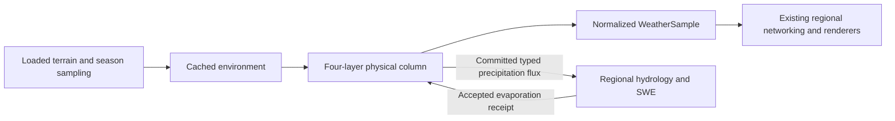

# Physical atmosphere

Wilderness Odyssey uses a physically motivated coarse weather model. It is not
numerical weather prediction, CFD, or a solution of the full Navier–Stokes equations.
One Minecraft block represents one metre horizontally and in the terrain lapse rate.
Elapsed server game ticks convert to seconds at 20 ticks per second; stopping the
server pauses time. Offline wall-clock weather is deliberately not inferred.

## Ownership and compatibility

`WeatherAuthority` and `AtmosphereGrid` remain the only weather owners.
`AtmosphereCell` retains an `AtmosphericPhysicalState` and its last captured
`AtmosphereEnvironment`. `WeatherSample` remains the normalized public/render
projection. Clamping a display value never removes water from the physical state.
Legacy sample constructors, queries, server authority, optional ownership arbitration,
and the Data Engine capture/calculate/validate/apply boundary remain available.



## Units

| Quantity | Physical state | Compatibility projection |
|---|---|---|
| Air/surface/layer temperature | °C | Air °C, unchanged |
| Horizontal pressure | Sea-level-equivalent hPa | `1 + (hPa - 1013.25) / 100` |
| Layer pressure | Hydrostatic hPa, from layer mean temperature | Diagnostic only |
| Horizontal/layer wind | m/s | Components divided by 40 |
| Vertical motion | m/s | Divided by 20 |
| Instability | Parcel-lift proxy in J/kg | Divided by 3000 |
| Vapor | Column kg/m² | Relative humidity from temperature-dependent capacity |
| Cloud liquid and ice | Separate column kg/m² | Sum divided by 2 |
| Precipitation | mm/hour, plus integrated mm per step | Rate divided by 50 |
| Snow, sleet, hail, freezing rain | mm liquid equivalent in the exchange | Existing surface cover projection |

One kg/m² is one mm of liquid water. The effective vapor capacity retains the
legacy Magnus scaling, with one old vapor inventory unit representing 25 mm.
This is a proportional column approximation rather than independently resolved
specific humidity in every pressure slab. Relative humidity may clip at 100%
for display while the full supersaturated vapor inventory remains stored.

## Processes

- `AtmosphericTransport` uses upwind shared-face fluxes, physical wind, `dt/dx`,
  and simultaneous old-state neighbors. Temperature is an intensive tracer;
  moisture reservoirs use conservative finite-volume differences.
- `WindPhysicsModel` applies `-gradient(P)/density`, friction, and a configurable
  regional Coriolis coefficient. Boundary-layer drag increases with roughness;
  upper layers retain momentum longer. Hydrostatic layer pressure responds to
  temperature, allowing shear and baroclinic flow.
- `SurfaceEnergyModel` combines solar forcing, cloud attenuation, clear-night
  longwave loss, snow albedo, biome vegetation/soil proxies, and a retained heat
  store. A half-metre water mixed layer moderates temperature more strongly than
  the responsive land skin. Vegetation and soil characteristics are coarse
  biome/wetness proxies, not a resolved surface materials model.
- `AtmosphericColumnModel` retains four temperatures and wind vectors at 0,
  1500, 3000, and 5500 metres above local terrain. Slowly relaxing upper air and
  transported layer temperatures can retain warm noses and surface inversions.
  Layer humidity diagnoses one shared column reservoir rather than adding four
  independent moisture inventories.
- `AtmosphericMoistureBudget` transfers identical masses between vapor, cloud
  liquid, and cloud ice. Condensation releases latent heat; cloud evaporation
  cools air and returns its mass to vapor. Sedimentation cannot exceed cloud
  water and removes exactly the published precipitation amount.
- Signed terrain lift is `wind dot terrainGradient`: ascent cools windward air;
  descent warms leeward air, reducing relative humidity without deleting vapor.
- Water coverage changes surface heat storage and aerodynamic evaporation.
  Differential heating drives land/water pressure gradients and breeze-like
  flow. Cold air advected over retained warm water can gain vapor and produce
  lake-effect precipitation through the same condensation budget.
- Front strength uses temperature/moisture/pressure contrasts, convergence,
  distance, and layer shear. Existing persistent front/storm identities remain
  associated with those observations. Convection grows from moisture, parcel
  instability, lift, shear, frontal support, and warm-ocean support.
- `CloudProperties` derives base, top, depth, liquid/ice fractions,
  precipitation potential, and convective character. Cloud-base dew-point and
  top/depth relations remain inexpensive approximations. Physical diagnostics
  use the physical classifier; existing clients derive presentation from the
  normalized fields and do not receive every layer's mass.

## Precipitation phase

`PrecipitationPhaseModel` integrates warm and near-surface cold wet-bulb layers
in degree-metres. A cold column produces snow. Melting above a deep cold layer
produces sleet; melting above a shallow cold layer produces freezing rain.
Liquid-supporting columns produce rain. Strong updrafts, instability, deep cloud,
and freezing air aloft permit hail. The six types are `NONE`, `RAIN`, `SNOW`,
`HAIL`, `SLEET`, and `FREEZING_RAIN`; existing ordinal IDs remain unchanged.

Season adapters change environmental temperature, humidity, and solar context.
A season cannot grant or deny snow permission. The legacy `snowSeasonFactor`
remains metadata for callers, rather than a precipitation gate.

The melting/refreezing thresholds represent residence-time and particle-size
effects approximately. Hail size distributions, collision/coalescence, ice
nucleation spectra, and explicit falling-particle columns are future work.
The qualitative phase model follows the
[NWS description of sleet and freezing rain](https://www.weather.gov/iwx/sleetvsfreezingrain);
wind forces follow the
[NWS discussion of pressure, wind, and fronts](https://www.weather.gov/lmk/basic-fronts).

## Conservation boundary

`AtmosphericWaterFlux` records elapsed seconds, accepted surface evaporation,
condensation, cloud evaporation, rain/snow/sleet/freezing-rain/hail, signed
external vapor forcing, and signed horizontal transport. For a closed domain:

`initial vapor + liquid + ice + accepted evaporation = final vapor + liquid + ice + precipitation`.

Unknown terrain and effectively infinite ocean forcing are explicit open
boundaries, visible separately in diagnostics. They are not advertised as finite
surface debits. Hydrology's finite accepted evaporation receipt is credited once,
independent of simulation speed or the number of numerical substeps. Regional
SWE/ice stores own frozen precipitation and transfer the same stored water on
melting; visual snow cover does not create a second meltwater source.

## Operational checks

Use Java 21 and the checked-in Gradle wrapper. Quote the project property in
Windows PowerShell so the output directory remains one argument:

```powershell
.\gradlew.bat compileJava '-PcodexBuildDir=.codex-build' --no-parallel
.\gradlew.bat weatherPhysicsTest '-PcodexBuildDir=.codex-build' --no-parallel
```

After automated checks, use a disposable world for runtime validation. Compare
windward/leeward terrain, a warm lake under cold air, and clear/cloudy nights.
Record physical diagnostics and water budgets before and after an interval.
Save/restart and compare retained physical inventories and storm IDs. Repeat
with two clients at the same position, with players leaving the sampled area,
and at supported alternate cell widths and update intervals. Confirm loaded
chunk counts do not grow because of weather sampling. Client appearance,
multiplayer convergence, and modpack performance require these live checks;
compilation and pure tests alone do not establish them.
