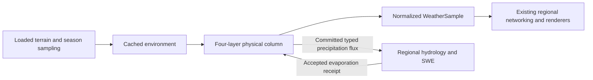

# Physical atmosphere

Wilderness Odyssey uses a physically motivated coarse weather model. It is not
numerical weather prediction, CFD, or a solution of the full Navier–Stokes equations.
One Minecraft block represents one metre horizontally and in the terrain lapse rate.
Elapsed server game ticks convert to seconds at 20 ticks per second; stopping the
server pauses time. Offline wall-clock weather is deliberately not inferred.

## Ownership and compatibility

`WeatherAuthority` and `AtmosphereGrid` remain the only weather owners.
`AtmosphereCell` retains an `AtmosphericPhysicalState` and its last captured
`AtmosphereEnvironment`. `WeatherSample` remains the normalized public/render
projection. Clamping a display value never removes water from the physical state.
Legacy sample constructors, queries, server authority, optional ownership arbitration,
and the Data Engine capture/calculate/validate/apply boundary remain available.



## Units

| Quantity | Physical state | Compatibility projection |
|---|---|---|
| Air/surface/layer temperature | °C | Air °C, unchanged |
| Horizontal pressure | Sea-level-equivalent hPa | `1 + (hPa - 1013.25) / 100` |
| Layer pressure | Hydrostatic hPa, from layer mean temperature | Diagnostic only |
| Horizontal/layer wind | m/s | Components divided by 40 |
| Vertical motion | m/s | Divided by 20 |
| Instability | Parcel-lift proxy in J/kg | Divided by 3000 |
| Vapor | Column kg/m² | Relative humidity from temperature-dependent capacity |
| Cloud liquid and ice | Separate column kg/m² | Sum divided by 2 |
| Precipitation | mm/hour, plus integrated mm per step | Rate divided by 50 |
| Snow, sleet, hail, freezing rain | mm liquid equivalent in the exchange | Existing surface cover projection |

One kg/m² is one mm of liquid water. The effective vapor capacity retains the
legacy Magnus scaling, with one old vapor inventory unit representing 25 mm.
This is a proportional column approximation rather than independently resolved
specific humidity in every pressure slab. Relative humidity may clip at 100%
for display while the full supersaturated vapor inventory remains stored.

## Processes

- `AtmosphericTransport` uses upwind shared-face fluxes, physical wind, `dt/dx`,
  and simultaneous old-state neighbors. Temperature is an intensive tracer;
  moisture reservoirs use conservative finite-volume differences.
- `WindPhysicsModel` applies `-gradient(P)/density`, friction, and a configurable
  regional Coriolis coefficient. Boundary-layer drag increases with roughness;
  upper layers retain momentum longer. Hydrostatic layer pressure responds to
  temperature, allowing shear and baroclinic flow.
- `SurfaceEnergyModel` combines solar forcing, cloud attenuation, clear-night
  longwave loss, snow albedo, biome vegetation/soil proxies, and a retained heat
  store. A half-metre water mixed layer moderates temperature more strongly than
  the responsive land skin. Vegetation and soil characteristics are coarse
  biome/wetness proxies, not a resolved surface materials model.
- `AtmosphericColumnModel` retains four temperatures and wind vectors at 0,
  1500, 3000, and 5500 metres above local terrain. Slowly relaxing upper air and
  transported layer temperatures can retain warm noses and surface inversions.
  Layer humidity diagnoses one shared column reservoir rather than adding four
  independent moisture inventories.
- `AtmosphericMoistureBudget` transfers identical masses between vapor, cloud
  liquid, and cloud ice. Condensation releases latent heat; cloud evaporation
  cools air and returns its mass to vapor. Sedimentation cannot exceed cloud
  water and removes exactly the published precipitation amount.
- Signed terrain lift is `wind dot terrainGradient`: ascent cools windward air;
  descent warms leeward air, reducing relative humidity without deleting vapor.
- Water coverage changes surface heat storage and aerodynamic evaporation.
  Differential heating drives land/water pressure gradients and breeze-like
  flow. Cold air advected over retained warm water can gain vapor and produce
  lake-effect precipitation through the same condensation budget.
- Front strength uses temperature/moisture/pressure contrasts, convergence,
  distance, and layer shear. Existing persistent front/storm identities remain
  associated with those observations. Convection grows from moisture, parcel
  instability, lift, shear, frontal support, and warm-ocean support.
- `CloudProperties` derives base, top, depth, liquid/ice fractions,
  precipitation potential, and convective character. Cloud-base dew-point and
  top/depth relations remain inexpensive approximations. Physical diagnostics
  use the physical classifier; existing clients derive presentation from the
  normalized fields and do not receive every layer's mass.

## Precipitation phase

`PrecipitationPhaseModel` integrates warm and near-surface cold wet-bulb layers
in degree-metres. A cold column produces snow. Melting above a deep cold layer
produces sleet; melting above a shallow cold layer produces freezing rain.
Liquid-supporting columns produce rain. Strong updrafts, instability, deep cloud,
and freezing air aloft permit hail. The six types are `NONE`, `RAIN`, `SNOW`,
`HAIL`, `SLEET`, and `FREEZING_RAIN`; existing ordinal IDs remain unchanged.

Season adapters change environmental temperature, humidity, and solar context.
A season cannot grant or deny snow permission. The legacy `snowSeasonFactor`
remains metadata for callers, rather than a precipitation gate.

The melting/refreezing thresholds represent residence-time and particle-size
effects approximately. Hail size distributions, collision/coalescence, ice
nucleation spectra, and explicit falling-particle columns are future work.
The qualitative phase model follows the
[NWS description of sleet and freezing rain](https://www.weather.gov/iwx/sleetvsfreezingrain);
wind forces follow the
[NWS discussion of pressure, wind, and fronts](https://www.weather.gov/lmk/basic-fronts).

## Conservation boundary

`AtmosphericWaterFlux` records elapsed seconds, accepted surface evaporation,
condensation, cloud evaporation, rain/snow/sleet/freezing-rain/hail, signed
external vapor forcing, and signed horizontal transport. For a closed domain:

`initial vapor + liquid + ice + accepted evaporation = final vapor + liquid + ice + precipitation`.

Unknown terrain and effectively infinite ocean forcing are explicit open
boundaries, visible separately in diagnostics. They are not advertised as finite
surface debits. Hydrology's finite accepted evaporation receipt is credited once,
independent of simulation speed or the number of numerical substeps. Regional
SWE/ice stores own frozen precipitation and transfer the same stored water on
melting; visual snow cover does not create a second meltwater source.

## Operational checks

`/wilderness weather physics` reports the retained cell's physical values, four
layer winds, integrated last-batch evaporation/precipitation/boundary volumes,
cell steps, calculation milliseconds, deferred ticks and the shared worker
queue. `/wilderness weather systems` identifies storms/fronts; `sample` reports
the local front classification. These operator-only commands do no extra
simulation and add no production rendering or per-tick log output.

`weather.simulation.coriolisPerSecond` defaults to `0.0001`; its sign selects a
hemisphere-like deflection and zero disables it. `maximumPhysicalCellSteps`
defaults to 16384 per batch. At least one complete tick generation is allowed,
including stable substeps at small cell widths/high speed. Deferred time remains
in the cell clock. A zero simulation speed consumes paused time without moving
the physical state or consuming water receipts, so resuming does not replay the
pause. All retained cells evolve with player-independent coarse physics; player
interest still controls admission, loaded effects and snapshots.

Atmosphere storage is version 4 (exact physical state plus compatibility words),
persistent-system storage is version 2, regional snapshots are protocol 6, and
distant-thunder snapshots are protocol 2. Save versions 1–3 and legacy snapshot
decoders remain supported. The network registration handshake is version 30;
clients and servers must update together to use the expanded phase protocol.
This is source/API compatibility where old constructors are retained, not a
promise that every separately compiled record consumer is binary compatible.

Retention remains bounded. Exploration beyond the configured cell cap evicts
cells, and changing atmospheric width resets the grid under the existing
configuration contract. Width rounds down to a 16-block multiple for exchange
accounting. Domain admission/eviction/reset is outside closed-domain conservation.
Cached forcing supports orderly restart and unloaded cells; separate atmosphere
and water save files are not crash-atomic. Historic forcing is not replayed for
backlogged time. These are explicit limits of the coarse persistence model.

Use Java 21 and the checked-in Gradle wrapper. Quote the project property in
Windows PowerShell so the output directory remains one argument:

```powershell
.\gradlew.bat compileJava '-PcodexBuildDir=.codex-build' --no-parallel
.\gradlew.bat weatherPhysicsTest '-PcodexBuildDir=.codex-build' --no-parallel
```

After automated checks, use a disposable world for runtime validation. Compare
windward/leeward terrain, a warm lake under cold air, and clear/cloudy nights.
Record physical diagnostics and water budgets before and after an interval.
Save/restart and compare retained physical inventories and storm IDs. Repeat
with two clients at the same position, with players leaving the sampled area,
and at supported alternate cell widths and update intervals. Confirm loaded
chunk counts do not grow because of weather sampling. Client appearance,
multiplayer convergence, and modpack performance require these live checks;
compilation and pure tests alone do not establish them.

## Component and regression map

Paths below are relative to `src/main/java/com/thunder/wildernessodysseyapi`.

| Files/components | Responsibility |
|---|---|
| `weather/simulation/AtmosphereCell`, `AtmosphereGrid`, `WeatherAuthority`, `AtmosphericGridStepper` | Retain physical state; capture, budget, advance, validate and commit synchronous generations. |
| `AtmosphericPhysicalState`, `AtmosphericUnits`, `AtmosphericLayer`, `AtmosphericColumn`, `AtmosphericColumnModel` in `weather/simulation` | Explicit units and four-layer continuity alongside the normalized API. |
| `AtmosphericTransport`, `AtmosphericMoistureBudget`, `AtmosphericWaterFlux` in `weather/simulation` | Conservative transport, phase transfers and typed integrated precipitation. |
| `WindPhysicsModel`, `SurfaceEnergyModel`, `AtmosphericFrontModel`, `CloudProperties`, `PrecipitationPhaseModel` in `weather/simulation` | Physical forcing, cloud geometry and precipitation classification. |
| `weather/system/WeatherSystemTracker`, `WeatherSystemStorageCodec`; `weather/forecast/WeatherThreatForecastService` | Persistent motion, bounded association, lifecycle and matching forecast time units. |
| `weather/storage/AtmosphereStorageCodec`, `PhysicalAtmosphereStorageCodec`; `weather/simulation/AtmosphereInputSampler` | Exact inventory/profile persistence and unloaded environment continuity. |
| `watersystem/water/hydrology/AtmosphericWaterExchange`, `RegionalHydrologyManager`, `RegionalHydrologyModel`, `RegionalHydrologySavedData`, `RegionalHydrologyState` | Accepted finite ET, pending precipitation, SWE/ice ownership and durable watermarks. |
| `weather/api`, `weather/networking`, existing precipitation render/audio consumers and localized mixins | Six-phase compatibility, versioned codecs and client/server phase parity. |
| `weather/config/WeatherConfig`, `weather/debug/PhysicalWeatherDiagnostics`, `WeatherDebugCommand` | Bounded controls and operator diagnostics. |

| Regression group | Contract exercised |
|---|---|
| `AtmosphericPhysicsTest` | Closed water cycle, accepted ET, supersaturation, timestep convergence, gradients, front resolution, friction, all phases, orography and surface energy. |
| `AtmosphericGridStepperTest` | Synchronous multi-cell conservation, activity independence, deferred work, maximum-speed minimum-cell progress, differing clocks, cadence and pause/resume. |
| `AtmosphericTransportTest` | A 10 m/s vapor pulse moves 600 metres in 60 seconds at 128, 256 and 512 metre widths while conserving mass. |
| `PhysicalAtmosphericExchangeTest` | Equal regional debit/atmospheric credit, restart, phase destinations, fractional carry, rejected capacity and area weighting. |
| `PhysicalAtmosphereStorageCodecTest` | Repeated exact saves, warm noses, supersaturated inventory, every phase, independent v3 fixture, corrupt-row isolation and seasonal humidity continuity. |
| Tracker/forecast, grid/snapshot, network and precipitation tests | Continuous identity motion/merges, old velocity migration, cadence-independent decay, six-phase interpolation, codec compatibility and visual mappings. |
| `WeatherDataEngineGameTests` | Loaded-server capture/worker/apply path with physical inventory, layer and step-counter assertions; requires an actual GameTest run. |


## Recorded validation

The September 11, 2026 implementation run completed production compilation,
`weatherPhysicsTest` and mod packaging with JDK 21 and isolated `.codex-build`
output. The final focused suite recorded **325 tests in 75 suites, zero failures,
zero errors and zero skipped tests**. `git diff --check` also completed cleanly.
The September 14 continuation confirmed the checkout and packaged artifact.

Commands used, from the repository root:

```powershell
.\gradlew.bat compileJava '-PcodexBuildDir=.codex-build' --no-daemon --no-parallel --console=plain
.\gradlew.bat weatherPhysicsTest build '-PcodexBuildDir=.codex-build' --no-daemon --no-parallel --console=plain
.\gradlew.bat weatherPhysicsTest '-PcodexBuildDir=.codex-build' --no-daemon --no-parallel --console=plain
```

The final test-only pass included the added advection-distance and primitive
phase-query regressions; production source and the packaged JAR were unchanged.
The repository's `build` task performs assembly without the full JUnit suite,
so the separately completed focused task is the test evidence. This does not
claim that every unrelated repository test ran.

The regular mod artifact is `.codex-build/libs/wildernessodysseyapi-4.2.0.jar`.
Its physical simulation, persistence, diagnostics classes and NeoForge metadata
were checked in the archive. Its SHA-256 at verification was
`6690680787D7F2ACD59D9FE17435F254EF99F421F09245E3024EF062C7DE291B`.

Gradle reported an existing StructureGen catalog fingerprint mismatch and
skipped optional modded catalog content; the three configured structures still
validated/generated, and packaging succeeded. Initial sandbox access failures
were resolved for validation with approved execution outside the sandbox.
No permissions, caches or generated dependency JARs were modified as recovery.

The updated GameTest source compiled, but `runGameTestServer`, live client/server,
two-client synchronization, visual weather acceptance and representative modpack
performance have **not** been run for this upgrade. Use the operational checks
above and the main localized-atmosphere checklist for that runtime acceptance.
